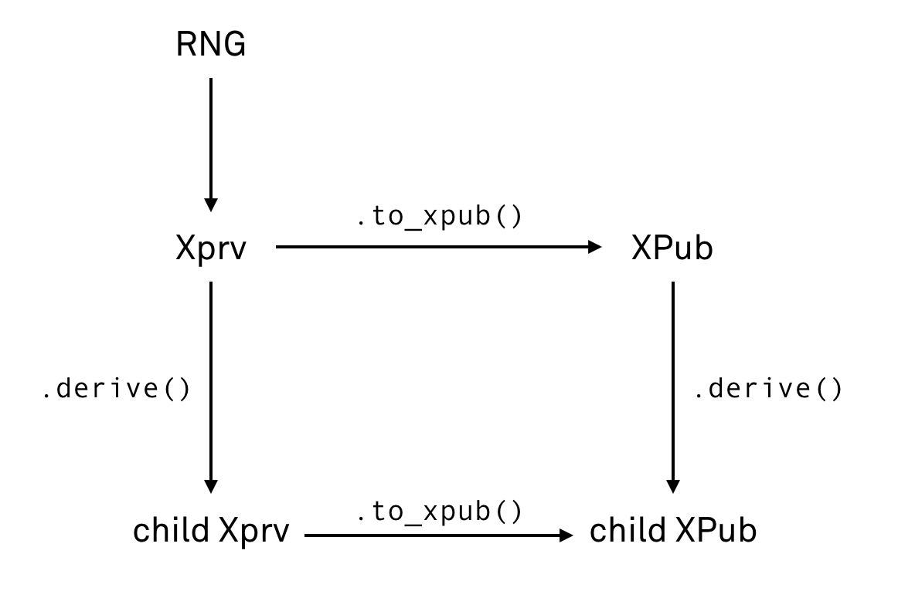

# Key tree

This is a _key blinding scheme_ for deriving hierarchies of public keys.

The most important feature of this scheme is that a set of _public_ keys can be derived from a _public_ key,
without the use of private keys. This allows a piece of software to generate unique receiving addresses
without having the private key material available (e.g., an online merchant may keep only public keys on the server and generate invoices with unique keys without compromising security of the private keys).

## Definitions

### Scalar

A _scalar_ is an integer modulo [Ristretto group](https://ristretto.group) order `|G| = 2^252 + 27742317777372353535851937790883648493`.

Scalars are encoded as 32-byte strings using little-endian convention.

Every scalar is required to be in a canonical (reduced) form.

### Point

A _point_ is an element in the [Ristretto group](https://ristretto.group).

Points are encoded as _compressed Ristretto points_ (32-byte strings).


### Base point

Ristretto base point in compressed form:

```
B = e2f2ae0a6abc4e71a884a961c500515f58e30b6aa582dd8db6a65945e08d2d76
```

### Derivation key

Uniformly random secret 32-byte string used to derive blinding factors.

### Xprv

Stands for _extended private key_: consists of a secret [scalar](#scalar) and a [derivation key](#derivation-key).

```rust
struct Xprv {
  scalar: Scalar,
  dk: [u8; 32],
}
```

### Xpub

Stands for _extended public key_: consists of a [point](#point) and a [derivation key](#derivation-key).

```rust
struct Xpub {
  point: RistrettoPoint,
  dk: [u8; 32],
}
```

Xpub is _semi-private_: it must be shared only with parties that are allowed to link together payments
that belong to the same root key. For instance, an online checkout software needs an Xpub
to generate individual public keys per invoice.

If you need to share an individual public key, use [leaf key derivation](#derive-a-leaf-key).

## Operations



### Generate key

1. Acquire a secure random number generator.
2. Generate a random 64-byte string, reduce it modulo Ristretto group order into a secret `scalar`.
3. Generate a random 32-byte string as a _derivation key_ `dk`.
4. Package the scalar and a derivation key in a [Xprv](#xprv) structure:
	```
	xprv = Xprv { scalar, dk }
	```

5. Return the resulting extended private key `xprv`.

### Convert Xprv to Xpub

Multiply base point by xprv's scalar.

```
Xpub {
	point: xprv.scalar·B,
	dk: xprv.dk
}
```

### Derive an intermediate key

This applies to both Xpubs and Xprvs.

1. Create a Merlin transcript as a PRF instance `prf = Transcript::new("Keytree.derivation")`.
2. If you are deriving from a parent Xprv, [create its corresponding parent Xpub first](#convert-xprv-to-xpub).
3. Commit [xpub](#xpub) to the transcript:
	```
	prf.append("pt", xpub.point)
	prf.append("dk", xpub.dk)
	```
4. Provide the transcript to the user to commit an arbitrary derivation path or index:
	```
	prf.append(label, data)
	```
	E.g. `prf.append_u64("account", account_id)` for an account within a hierarchy of keys.
5. Squeeze a blinding factor `f`:
	```
	f = prf.challenge_scalar("f.intermediate")
	```
6. Squeeze a new derivation key `dk2` (32 bytes):
	```
	dk2 = prf.challenge_bytes("dk")
	```
7. If you are deriving a child Xprv from a parent Xprv:
	```
	child = Xprv { scalar: parent.scalar + f, dk: dk2 }
	```
	 If you are deriving a child Xpub from a parent Xpub:
	```
	child = Xpub { point: parent.point + f·B, dk: dk2 }
	```

### Derive a leaf key

Similar to the intermediate derivation, but for safety is domain-separated so the same index produces unrelated public key.

1. Create a Merlin transcript `t = Transcript::new("Keytree.derivation")`.
2. If you are deriving from a parent Xprv, [create its corresponding parent Xpub first](#convert-xprv-to-xpub).
3. Commit [xpub](#xpub) to the provided key's PRF:
	```
	prf.append("pt", xpub.point)
	prf.append("dk", xpub.dk)
	```
4. Provide the transcript to the user to commit an arbitrary selector data (could be structured):
	```
	prf.append(label, data)
	```
	E.g. `prf.append_u64("invoice", invoice_index)` for a receiving address.
5. Squeeze a blinding factor `f`:
	```
	f = prf.challenge_scalar("f.leaf")
	```
6. If you are deriving a child Xprv from a parent Xprv:
	```
	child = parent.scalar + f
	```
	 If you are deriving a child Xpub from a parent Xpub:
	```
	child = parent.point + f·B
	```


## Test vectors

Root keys:

	R.Xprv: 00000000000000000000000000000000000000000000000000000000000000000000000000000000000000000000000000000000000000000000000000000000
	R.Xpub: 00000000000000000000000000000000000000000000000000000000000000000000000000000000000000000000000000000000000000000000000000000000

Derived intermediate children (`R->C`) with `PRF.append("index", LE64(1))`:

	C.Xprv: ba9bead5df738767ca184900a4a09ce8afe9f7696e8d3ac1fd99f607a785bf005237586d5b496618a49a876e9a7e077b1715f8635b41b48edcaf2934ebe62683
	C.Xpub: 2ec9d53d9d43b86c73694f4acd4be1c274a3cf8d7512e91acebafc0ed884dd475237586d5b496618a49a876e9a7e077b1715f8635b41b48edcaf2934ebe62683

Derived intermediate grand-children (`C->G`) with `PRF.append("index", LE64(1))`:
	
	G.Xprv: d4719a691dc4e97b27abfc50764d0369a197b3d03b049f0654d4872dd5f01f02f334cb814294776de8551a4e6382c14d05ad2eb6d6391e87069a3fbe2e6ecf77
	G.Xpub: 1210a34624dfddb312da90ad5e2d3d4649d7eb50d44dad00972d1e1f422a4f29f334cb814294776de8551a4e6382c14d05ad2eb6d6391e87069a3fbe2e6ecf77

Derived leaf keys from the intermediate children (`C->L`) with `PRF.append("index", LE64(1))`:

	L.Scalar: a7a8928dfeae1479a7bf908bfa929b714a62fe334b68e4557105414113ffca04
	L.Point:  52ea0c9ce1540e65041565a1057aa6965bbb5b42709c1109da16609248a9d679
