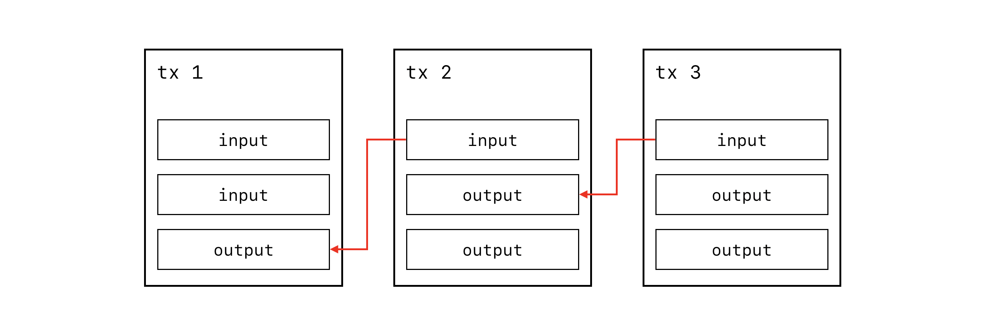
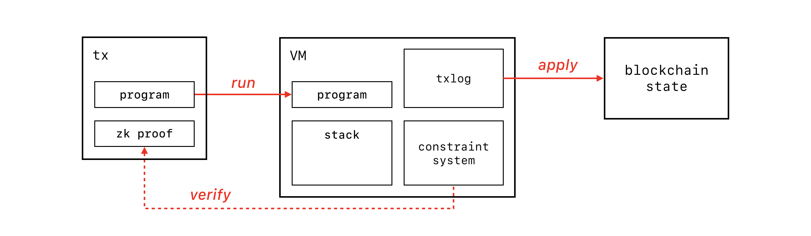
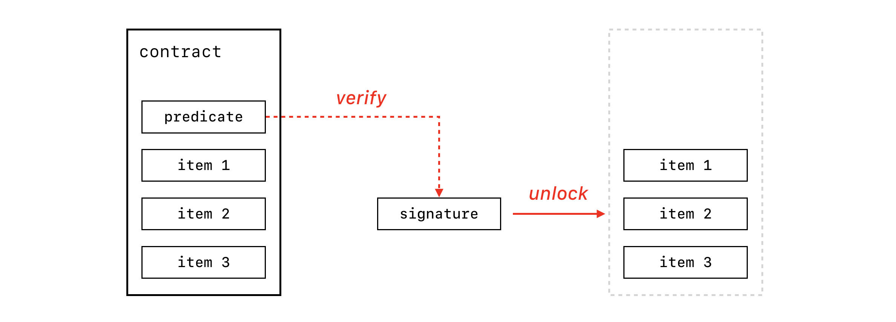
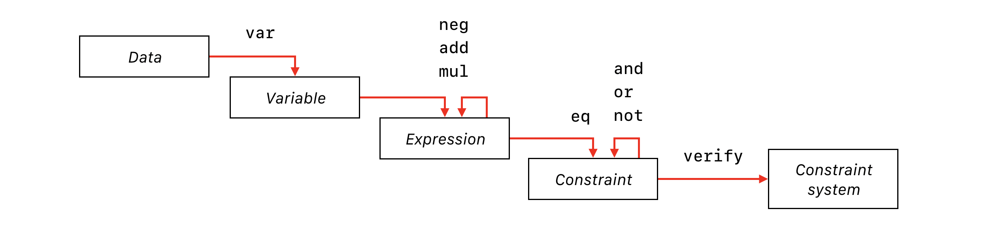
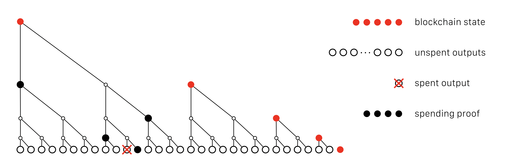

# ZkVM: fast, private, flexible blockchain contracts

[📄 ZkVM whitepaper](https://github.com/stellar/slingshot/files/3164245/zkvm-whitepaper-2019-05-09.pdf) (PDF)

## Table of contents

* [Introduction](#introduction)
* [Transactions](#transactions)
* [Program execution](#program-execution)
* [Contracts](#contracts)
* [Constraints](#constraints)
* [Scalability](#scalability)
* [Privacy](#privacy)
* [Performance](#performance)
* [Conclusion](#conclusion)
* [Future work](#future-work)
* [Authors](#authors-a-z)
* [References](#references)

## Introduction

In this paper, we present ZkVM, the _zero-knowledge virtual machine_: a transaction format for a shared, multi-asset, cryptographic ledger.

ZkVM aims at lowering the costs of participating in a global network by making transactions _customizable_, _confidential_, highly _efficient_ and _simple_.

**Customizable:** ZkVM permits custom contracts. Contracts support realistic use cases via programmable constraints over encrypted data and assets. The VM supports a powerful language to express a wide range of higher-level protocols without the need to change the VM and upgrade the entire network.

**Confidential:** In ZkVM, quantities and types of assets are fully encrypted. The asset flow is hidden on the transaction level. Individuals and organizations can safely perform their transactions directly on the shared ledger, instead of keeping them in siloed databases.

**Efficient:** The ZkVM blockchain uses a compact data model that fits in a few kilobytes. Verification of transactions is highly parallelizable and takes 1-2 ms per CPU core. Nodes can bootstrap instantly from a network-verified snapshot. Virtually any computing device can run a full node, without relying on intermediate infrastructure and trusted third parties. Devices with limited cellular data plans can save bandwidth by tracking relevant state updates only (e.g. watching their own payment channels), without having to verify all transactions.

**Simple:** ZkVM requires no special compilers, debuggers, or optimizers. Its abstractions map well onto real-world concepts, and the technology stack consists of a small number of inventions reviewed by a global community of cryptographers and engineers.
ZkVM is an evolution of the authors’ prior work on [TxVM](https://github.com/chain/txvm/blob/main/whitepaper/whitepaper.pdf), which in turn was influenced by the design of [Bitcoin](https://bitcoin.org/bitcoin.pdf) and [Ethereum](https://ethereum.github.io/yellowpaper/paper.pdf). The motivation for such ledgers was originally expressed in the paper Secure Property Titles by [Nick Szabo](https://nakamotoinstitute.org/secure-property-titles/).

## Transactions

A ZkVM _transaction_ is a data structure around a _program_ that describes the issuance and transfer of _financial assets_.
A transaction also contains data such as protocol version, time bounds, and cryptographic proofs necessary to verify the correctness of the transaction.

Assets are created via _issuance_: each asset is securely identified by its issuer’s predicate (public key), so only the issuer’s signature can authorize creation of additional units of the asset (see [`issue`](zkvm-spec.md#issue)). Asset units are removed from circulation with a dedicated [`retire`](zkvm-spec.md#retire) instruction.

Assets are transferred by use of _inputs_ and _outputs_. Each output specifies a new destination for the funds, and each input identifies an output from a previous transaction and unlocks its value with a cryptographic signature. The input is said to _spend_ the earlier transaction’s output.

A payee can use the signatures to verify the chain of ownership, but also needs to make sure that the asset was not double-spent. This problem is solved with the _blockchain state_: a set of unspent outputs. Each time a transaction declares an input, an item is removed from the set. If the item has been removed (or never existed), the transaction is rejected. A _consensus protocol_ can ensure that all participants in the network agree on the same blockchain state.

A ZkVM blockchain can work with any consensus protocol, from proof-of-work to Federated Byzantine Consensus. It can even work as a private financial database with real-time auditability. The exact protocol depends on its concrete application, which is outside the scope of this document.

## Program execution

ZkVM is a stack machine for verifying a transaction. The stack machine executes the transaction’s program in order to determine the validity of the transaction and to compute a list of updates to the blockchain state.

A transaction’s program is a string of bytecode, which consists of instructions that allow spending, issuing and distributing asset values, composing arithmetic constraints, and interacting with contracts. The VM does not permit loops or unbounded recursion, which greatly simplifies the calculation of the costs of operating the network and eliminates entire classes of vulnerabilities.

Instructions operate on items of distinct types: plain data types such as scalars and group elements, and [linear types](https://en.wikipedia.org/wiki/Substructural_type_system) such as _values_ and _contracts_.

Each instruction is a high-level operation that embodies the protocol rules. For instance, the [`cloak`](zkvm-spec.md#cloak) instruction not only allows a program to redistribute assets but also checks that the balances are preserved.

ZkVM executes a transaction’s program deterministically, in full isolation from the blockchain state. Instructions like [`input`](zkvm-spec.md#input) and [`output`](zkvm-spec.md#output) add entries to a _transaction log_. The transaction log describes changes to the blockchain state dictated by the transaction: old outputs to consume and new outputs to create. The application of  these changes to the blockchain state happens in a separate phase. This separation allows transactions to be executed either in arbitrary order or in parallel, synchronizing only on delete/insert operations for the transaction outputs.

## Contracts

In ZkVM, _values_ are protected by _contracts_. Each contract contains a _payload_ and a _predicate_. The payload is an arbitrary number of items that could be _values_ or data parameters. The predicate is a condition that must be satisfied in order to unlock the items in the payload.

Transaction outputs are nothing more or less than contracts persisted to the blockchain state. During validation, contracts exist on the VM stack. ZkVM requires the transaction program to _clear_ contracts from the stack, which can only be done by satisfying their predicates. Once the items are unlocked, they can be used to form new items to be locked in either a transient contract (to be unlocked again later in the same transaction) or a persistent output (to be added to the blockchain state).

The ZkVM instruction set is expressive enough to build a wide range of protocols using contracts: payment channels, order books, multi-factor/multi-party custody, collateralized loans, and even arbitrary state machines.

Predicates can be satisfied with either a _signature_ or the execution of a _sub-program_. The most common way to satisfy a predicate is with the [`signtx`](zkvm-spec.md#signtx) instruction that verifies a signature over a hash of the entire transaction, interpreting the predicate as a public key. Alternatively, the [`call`](zkvm-spec.md#call) instruction reveals a sub-program embedded in a predicate and executes it before the main program continues. Finally, the [`signid`](zkvm-spec.md#signid) and [`signtag`](zkvm-spec.md#signtag) instructions provide maximum flexibility: they execute an arbitrary program not contained in the predicate (after verifying a signature).

Operations on predicates are implemented using the [Taproot commitment scheme](https://lists.linuxfoundation.org/pipermail/bitcoin-dev/2018-January/015614.html) by Gregory Maxwell that offers a privacy-flexibility tradeoff based on real-world use cases.

Consider, for example, a two-party financial contract. If both parties cooperate, they can form a ZkVM program that reconstitutes the contract from an unspent output in the blockchain state, unlocks the value it contains in its payload, redistributes it using the [`cloak`](zkvm-spec.md#cloak) instruction, and creates new outputs. The transaction is simply signed by both parties to satisfy the predicate. If the parties do not cooperate, or if some conditions cannot be satisfied by a simple signature, one of the parties can disclose the appropriate sub-program (or _clause_) embedded in the predicate and let ZkVM execute it before continuing with the main program. For instance, a loan contract can time out and allow the creditor to claim the collateral locked in a contract.

The implementation provides a powerful and safe Rust API for composing arbitrary contracts and transactions directly, without the need for specialized languages and compilers.

## Constraints

Alongside the stack and the transaction log, VM state contains a _constraint system_, where arithmetic and boolean instructions add _constraints_ during program execution.

In order to preserve confidentiality, ZkVM instructions do not operate on ordinary integers and booleans. Instead, they operate on _Expression_ types (arithmetic combinations of secret integers) and _Constraint_ types (logical functions of secret booleans).

First, the arithmetic relations between secret and non-secret integers are expressed using [`neg`](zkvm-spec.md#neg), [`add`](zkvm-spec.md#add), and [`mul`](zkvm-spec.md#mul) operations that produce an _Expression_ object. Then, the [`eq`](zkvm-spec.md#eq) instruction creates a _Constraint_ object that asserts the equality of two _Expressions_. Multiple _Constraints_ are composed with logical operations such as [`and`](zkvm-spec.md#and), [`or`](zkvm-spec.md#or) and [`not`](zkvm-spec.md#not). Finally, the [`verify`](zkvm-spec.md#verify) instruction takes the resulting _Constraint_ object and adds it to the constraint system.

To implement verification of the constraints in zero-knowledge, ZkVM uses the [Bulletproofs proving system](https://crypto.stanford.edu/bulletproofs/). While the program runs, various instructions add constraints to the constraint system. After the VM finishes execution of a program, it uses the Bulletproofs protocol to verify the constraint system using a proof string stored within the transaction. If verification succeeds, the transaction is considered valid.

To construct the proof string, the creator of a transaction first runs the VM in _proving mode_. The transaction program creates the same constraints as in verification mode, but instead of checking the proof, the constraint system is used to _generate a proof_ and finalize the transaction structure. To make this possible, the program is represented as an array of _Instruction_ objects that carry _witness information_ such as blinding factors or secret quantities. This information is erased when the program is converted to bytecode for publication on the blockchain.

VM instructions directly interact with the constraint system, without using any intermediate representation such as a syntax trees or arithmetic circuits, and without any compilation/optimization phases.

## Scalability

ZkVM is designed to scale to a wide range of applications and large volumes of transactions. The design focuses on low bandwidth requirements, fast and parallelizable transaction verification, and minimal storage overhead.

A ZkVM transaction contains a single constraint system proof (around 1Kb) and a single 64-byte Schnorr signature, aggregated via the multi-message [Musig protocol](https://eprint.iacr.org/2018/068.pdf) by Maxwell, Poelstra, Seurin and Wuille. The size of the proof scales logarithmically, lowering the marginal cost of an input-output pair to just 200 bytes that can be further optimized by caching most recent outputs.

ZkVM execution is decoupled from updates to the blockchain state: every transaction can be verified in isolation. The result of ZkVM execution is a _transaction log_, which contains a list of consumed and created _unspent outputs_ (_utxos_) that are applied to the blockchain state separately. Historical transactions are pruned, while the utxo set is compressed with [the Utreexo scheme](https://dci.mit.edu/utreexo) by Thaddeus Dryja [utreexo]. A billion unspent outputs use just 1 kilobyte of data (30 merkle roots). New nodes bootstrap instantly from a network-verified Utreexo snapshot.

Nodes that track large amounts of unspent outputs for their clients still have favorable storage requirements: the utxo set grows much more slowly than the number of transactions and has a cache-friendly access pattern (older outputs are spent less frequently).

Bandwidth-constrained nodes such as mobile devices with limited data plans can use [simplified payment verification](https://en.bitcoinwiki.org/wiki/Simplified_Payment_Verification) mode: instead of verifying all transactions they can track block headers only, to detect changes to their utxo proofs and the status of their [payment channels](https://lightning.network/lightning-network-paper.pdf), without the need for dedicated trusted services.

## Privacy

In ZkVM transactions, all asset quantities, asset types, and parameters to contracts are encrypted by default, unless explicitly unblinded. At the moment of issuance, an asset type must be public (because the asset type is tied to the authentication predicate), but the quantity is encrypted.

Asset flow within the scope of a transaction is fully encrypted: the M inputs and N outputs are generally indistinguishable to third-party observers (those without the blinding factors needed to decrypt them). However, the graph of transaction inputs and outputs is made public to efficiently prevent double-spending.

Asset flow _across_ transactions can be further obfuscated using a variant of the [CoinJoin scheme](https://bitcointalk.org/?topic=279249) by Gregory Maxwell, in which multiple payments are combined in a single multi-party transaction. This makes the flow of assets more diffuse and incidentally reduces the marginal proof size.

Complex contracts that contain data parameters (e.g. prices, expiration time, counters) may keep the parameters encrypted at a low cost. This way, invoking a contract discloses only its logic, not the data it’s operating on.

Predicates use the Taproot commitment scheme to pack an arbitrarily large set of conditions into a single public key. This allows users to avoid revealing contract logic in the first place. If all parties to a contract cooperate (e.g. closing a payment channel normally, without forced settlement), the network only has to see an aggregated signature, so neither the number of parties nor the nature of the contract has to be published. If the parties do not cooperate, Taproot allows revealing and verifying a required subset of conditions (_contract clause_), keeping all the others secret.

## Performance

ZkVM does not permit loops or unbounded recursion. All immediately executed operations are very cheap, and the cost of execution is proportional to the length of the transaction program. A typical program consists of a handful of short instructions (`input`, `signtx`, `output` and one `cloak`), with 128 bytes of data for each input and 96 bytes for each output. If any contract reveals a sub-program, it must be encoded directly in the main program and cannot be constructed on the fly.

Verification of signatures, constraints, and Taproot commitments are relatively expensive because they involve the scalar multiplication of elliptic-curve points. For that reason, these operations are deferred and performed in a batch after the VM is finished executing the transaction’s program.

Use of [the Ristretto group](https://ristretto.group) and its state-of-the-art vectorized implementation in [the Dalek project](https://doc.dalek.rs/curve25519_dalek/) reduces the cost of one output verification to 1ms on a modern 3 GHz CPU, which implies a throughput of 1000 outputs per second per core. Verification is also highly parallelizable to optimize latency-critical deployments. Proving time is in the order of several milliseconds per output.

Custom constraints created by contracts typically have significantly less overhead than the `cloak` instruction that merges and splits the input values into the outputs.

## Conclusion

ZkVM is a comprehensive solution that brings together the results of years of work by many researchers and developers in applied cryptography, programming languages, and cryptocurrencies.

It strikes the right balance between various partially conflicting requirements, producing a robust technology stack for the global financial system of the future.

ZkVM is part of the [Slingshot open source project](https://github.com/stellar/slingshot), distributed under the Apache License, version 2.0.

## Future work

To increase privacy, the [CoinJoin scheme](https://bitcointalk.org/?topic=279249) on top of ZkVM requires a multi-party proving algorithm for a joint constraint system proof. It would allow parties to not exchange their secrets, yet build a single proof for a joint transaction as if it was done by a single party.

Various higher-level protocols, such as _accounts_, _payment channels_ and _order books_, require dedicated APIs built on top of ZkVM. These are subject to the future work on ZkVM.

## Authors (A-Z)

* [Oleg Andreev](https://github.com/oleganza)
* [Bob Glickstein](https://github.com/bobg)
* [Vicki Niu](https://github.com/vickiniu)
* [Tess Rinearson
](https://github.com/tessr)
* [Debnil Sur](https://github.com/debnil)
* [Cathie Yun
](https://github.com/cathieyun)

with contributions from [Kev Wedderburn](https://github.com/decentralisedkev)

We thank Jessica Ling and Justin Rice for their feedback.

This work was sponsored by [Interstellar](https://interstellar.com) and [Stellar Development Foundation](https://stellar.org).

## References

* [TxVM: Transaction Virtual Machine](https://github.com/chain/txvm/blob/main/whitepaper/whitepaper.pdf) by Bob Glickstein, Cathie Yun, Dan Robinson, Keith Rarick, Oleg Andreev
* [Bitcoin: A Peer-to-Peer Electronic Cash System](https://bitcoin.org/bitcoin.pdf) by Satoshi Nakamoto
* [Ethereum: a secure decentralized generalized transaction ledger](https://ethereum.github.io/yellowpaper/paper.pdf) by Gavin Wood
* [Secure Property Titles with Owner Authority](https://nakamotoinstitute.org/secure-property-titles/) by Nick Szabo
* [Taproot: Privacy preserving switchable scripting](https://lists.linuxfoundation.org/pipermail/bitcoin-dev/2018-January/015614.html) by Gregory Maxwell
* [Bulletproofs: Short Proofs for Confidential Transactions and More](https://crypto.stanford.edu/bulletproofs/) by Benedikt Bünz, Jonathan Bootle, Dan Boneh, Andrew Poelstra, Pieter Wuille, Greg Maxwell
* [Bulletproofs implementation with Ristretto](https://github.com/dalek-cryptography/bulletproofs/) by Henry de Valence, Cathie Yun, Oleg Andreev
* [Simple Schnorr Multi-Signatures with Applications to Bitcoin](https://eprint.iacr.org/2018/068.pdf) by Gregory Maxwell, Andrew Poelstra, Yannick Seurin, Pieter Wuille
* [Utreexo: Reducing Bitcoin Nodes to 1 Kilobyte](https://dci.mit.edu/utreexo) ([transcript](https://diyhpl.us/wiki/transcripts/bitcoin-core-dev-tech/2018-10-08-utxo-accumulators-and-utreexo/)) by Thaddeus Dryja
* [The Bitcoin Lightning Network: Scalable Off-Chain Instant Payments](https://lightning.network/lightning-network-paper.pdf) by Joseph Poon, Thaddeus Dryja
* [CoinJoin: Bitcoin privacy for the real world](https://bitcointalk.org/?topic=279249) by Gregory Maxwell
* [The Ristretto Group](https://ristretto.group) by Mike Hamburg, Henry de Valence, Isis Lovecruft, Tony Arcieri
* [curve25519-dalek, pure-Rust implementation of Ristretto](https://doc.dalek.rs/curve25519_dalek/) by Isis Lovecruft, Henry de Valence

