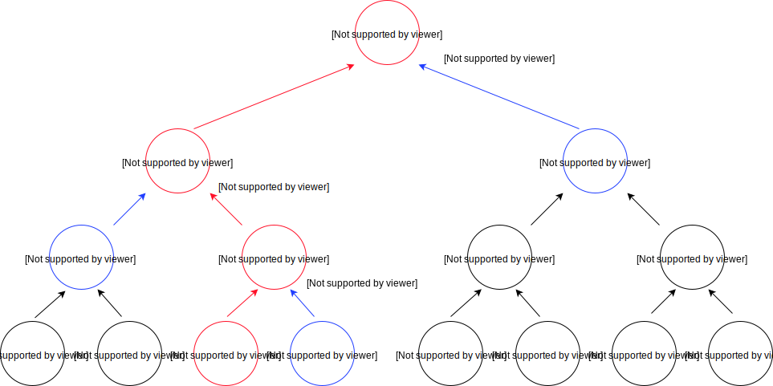

# ZkVM transaction specification

This is the specification for ZkVM, the zero-knowledge transaction virtual machine.

ZkVM defines a procedural representation for blockchain transactions and the rules for a virtual machine to interpret them and ensure their validity.

* [Overview](#overview)
    * [Motivation](#motivation)
    * [Concepts](#concepts)
* [Types](#types)
    * [Copyable types](#copyable-types)
    * [Droppable types](#droppable-types)
    * [Linear types](#linear-types)
    * [Portable types](#portable-types)
    * [String](#string-type)
    * [Program](#program-type)
    * [Contract](#contract-type)
    * [Variable](#variable-type)
    * [Expression](#expression-type)
    * [Constraint](#constraint-type)
    * [Value](#value-type)
    * [Wide value](#wide-value-type)
* [Definitions](#definitions)
    * [LE32](#le32)
    * [LE64](#le64)
    * [Scalar](#scalar-value)
    * [Point](#point)
    * [Base points](#base-points)
    * [Pedersen commitment](#pedersen-commitment)
    * [Verification key](#verification-key)
    * [Time bounds](#time-bounds)
    * [Contract ID](#contract-id)
    * [Anchor](#anchor)
    * [Transcript](#transcript)
    * [Predicate](#predicate)
    * [Program predicate](#program-predicate)
    * [Contract payload](#contract-payload)
    * [Output structure](#output-structure)
    * [UTXO](#utxo)
    * [Constraint system](#constraint-system)
    * [Constraint system proof](#constraint-system-proof)
    * [Transaction](#transaction)
    * [Transaction log](#transaction-log)
    * [Transaction ID](#transaction-id)
    * [Merkle binary tree](#merkle-binary-tree)
    * [Transaction signature](#transaction-signature)
    * [Unblinding proof](#unblinding-proof)
    * [Taproot](#taproot)
    * [Call proof](#call-proof)
    * [Blinded program](#blinded-program)
* [VM operation](#vm-operation)
    * [VM state](#vm-state)
    * [VM execution](#vm-execution)
    * [Deferred point operations](#deferred-point-operations)
    * [Versioning](#versioning)
* [Instructions](#instructions)
    * [Stack instructions](#stack-instructions)
    * [Constraint system instructions](#constraint-system-instructions)
    * [Value instructions](#value-instructions)
    * [Contract instructions](#contract-instructions)
* [Transaction Encoding](#transaction-encoding)
* [Examples](#examples)
    * [Lock value example](#lock-value-example)
    * [Unlock value example](#unlock-value-example)
    * [Simple payment example](#simple-payment-example)
    * [Offer example](#offer-example)
    * [Offer with partial lift](#offer-with-partial-lift)
    * [Loan example](#loan-example)
    * [Loan with interest](#loan-with-interest)
    * [Payment channel example](#payment-channel-example)
    * [Payment routing example](#payment-routing-example)
* [Discussion](#discussion)
    * [Relation to TxVM](#relation-to-txvm)
    * [Compatibility](#compatibility)
    * [Static arguments](#static-arguments)
    * [Should cloak and borrow take variables and not commitments?](#should-cloak-and-borrow-take-variables-and-not-commitments)
    * [Why there is no `and` combinator in the predicate tree?](#why-there-is-no-and-combinator-in-the-predicate-tree)
    * [Why we need Wide value and `borrow`?](#why-we-need-wide-value-and-borrow)
    * [How to perform an inequality constraint?](#how-to-perform-an-inequality-constraint)
    * [How to perform a logical `not`?](#how-to-perform-a-logical-not)
    * [What ensures transaction uniqueness?](#what-ensures-transaction-uniqueness)
    * [Open questions](#open-questions)


## Overview

### Motivation

[TxVM](https://github.com/chain/txvm/blob/main/whitepaper/whitepaper.pdf) introduced a novel representation for the blockchain transactions:
1. Each transaction is an executable program that produces effects to the blockchain state.
2. Values as first-class types subject to [linear logic](http://girard.perso.math.cnrs.fr/Synsem.pdf).
3. Contracts are first-class types that implement [object-capability model](https://en.wikipedia.org/wiki/Object-capability_model).

The resulting design enables scalable blockchain state machine (since the state is very small, and its updates are separated from transaction verification), expressive yet safe smart contracts via the sound abstractions provided by the VM, simpler validation rules and simpler transaction format.

TxVM, however, did not focus on privacy and in several places traded off simplicity for unlimited flexibility.

ZkVM is the entirely new design that inherits most important insights from the TxVM, makes the security and privacy its primary focus, and provides a more constrained customization framework, while making the expression of the most common contracts even more straightforward.

### Concepts

A transaction is represented by a [transaction](#transaction) object that
contains a [program](#program-type) that runs in the context of a stack-based virtual machine.

When the virtual machine executes a program, it creates and manipulates data of various types:
[**copyable types**](#copyable-types) and [**linear types**](#linear-types), such as [values](#value-type) and
[contracts](#contract-type).

A [**value**](#value-type) is a specific _quantity_ of a certain _flavor_ that can be
merged or split, issued or retired, but not otherwise created or destroyed.

A [**contract**](#contract-type) encapsulates a list of data and value items
protected by a [predicate](#predicate) (a public key or a program) which must be satisfied
during the VM execution. The contract can be stored in and loaded from the global state
using [`output`](#output) and [`input`](#input) instructions.

Custom logic is represented via programmable [**constraints**](#constraint-type)
applied to [**variables**](#variable-type) and [**expressions**](#expression-type)
(linear combinations of variables). Variables represent quantities and flavors of values,
[time bounds](#time-bounds) and user-defined secret parameters. All constraints are arranged in
a single [constraint system](#constraint-system) which is proven to be satisfied after the VM
has finished execution.

Some ZkVM instructions write proposed updates to the blockchain state
to the [**transaction log**](#transaction-log), which represents the
principal result of executing a transaction.

Hashing the transaction log gives the unique [**transaction ID**](#transaction-id).

A ZkVM transaction is valid if and only if it runs to completion
without encountering failure conditions and without leaving any data
on the stack.

After a ZkVM program runs, the proposed state changes in the
transaction log are compared with the global state to determine the
transaction’s applicability to the blockchain.


## Types

The items on the ZkVM stack are typed. The available types fall into two 
categories: [copyable types](#copyable-types) and [linear types](#linear-types).
All copyable types, and some linear types are [droppable](#droppable-types).

### Copyable types

Copyable types can be freely copied with [`dup`](#dup).

* [String](#string-type)
* [Variable](#variable-type)

Note: the [program](#program-type) is not copyable to avoid denial-of-service attacks
via repeated execution of the same program that can be scaled exponentially while
growing the transaction size only linearly.
For the same reason, [expressions](#expression-type) and [constraints](#constraint-type) are
not copyable either.


### Droppable types

Droppable types can be destroyed with [`drop`](#drop):

* [String](#string-type)
* [Program](#program-type)
* [Variable](#variable-type)
* [Expression](#expression-type)
* [Constraint](#constraint-type)


### Linear types

Linear types are subject to special rules as to when and how they may be created
and destroyed, and may never be copied.

* [Program](#program-type)
* [Expression](#expression-type)
* [Constraint](#constraint-type)
* [Contract](#contract-type)
* [Wide value](#wide-value-type)
* [Value](#value-type)


### Portable types

Only the [string](#string-type), [program](#program-type) and [value](#value-type) types can be _ported_ across transactions via [outputs](#output-structure).

Notes:

* [Wide values](#wide-value-type) are not portable because they are not proven to be non-negative.
* [Contracts](#contract-type) are not portable because they must be satisfied within the current transaction
or [output](#output-structure) their contents themselves.
* [Variables](#variable-type), [expressions](#expression-type) and [constraints](#constraint-type) have no meaning outside the VM state
and its constraint system, and therefore cannot be meaningfully ported between transactions.


### String type

A _string_ is a variable-length byte array used to represent [commitments](#pedersen-commitment), [scalars](#scalar-value), signatures, and proofs.

A string cannot be larger than the entire transaction program and cannot be longer than `2^32-1` bytes (see [LE32](#le32)).


### Program type

A _program type_ is a variable-length byte array representing a sequence of ZkVM [instructions](#instructions).

Program cannot be larger than the entire transaction program and cannot be longer than `2^32-1` bytes (see [LE32](#le32)).


### Contract type

A contract consists of a [predicate](#predicate) and a [payload](#contract-payload). The payload is guarded by the predicate.

Contracts are created with the [`contract`](#contract) instruction and
destroyed by evaluating the predicate, leaving their payload on the stack.

Contracts can be "frozen" with the [`output`](#output) instruction that places the predicate
and the payload into the [output structure](#output-structure) which is
recorded in the [transaction log](#transaction-log).

Each contract contains a hidden field [anchor](#anchor) that makes it globally unique for safe signing.


### Variable type

_Variable_ represents a secret [scalar](#scalar-value) value in the [constraint system](#constraint-system)
bound to its [Pedersen commitment](#pedersen-commitment).

A [point](#point) that represents a commitment to a secret scalar can be turned into a variable using the [`commit`](#commit) instruction.

A cleartext [scalar](#scalar-value) can be turned into a single-term [expression](#expression-type) using the [`scalar`](#scalar) instruction (which does not allocate a variable). Since we do not need to hide their values, a Variable is not needed to represent the cleartext constant.

Variables can be copied and dropped at will, but cannot be ported across transactions via [outputs](#output-structure).

[Value quantities and flavors](#value-type) are represented as variables.

Constraint system also contains _low-level variables_ that are not individually bound to [Pedersen commitments](#pedersen-commitment):
when these are exposed to the VM (for instance, from [`mul`](#mul)), they have the [expression type](#expression-type).


### Expression type

_Expression_ is a linear combination of constraint system variables with cleartext [scalar](#scalar-value) weights.

    expr = { (weight0, var0), (weight1, var1), ...  }

A [variable](#variable-type) can be converted to an expression using [`expr`](#expr):
the result is a linear combination with one term with weight 1:

    expr = { (1, var) }

Expressions can be [added](#add) and [multiplied](#mul), producing new expressions.


### Constant expression

An [expression](#expression-type) that contains one term with the [scalar](#scalar-value) weight assigned to the R1CS `1` is considered
a _constant expression_:

    const_expr = { (weight, 1) }

Instructions [`add`](#add) and [`mul`](#mul) preserve constant expressions as an optimization in order to avoid
allocating unnecessary multipliers in the [constraint system](#constraint-system).


### Constraint type

_Constraint_ is a statement within the [constraint system](#constraint-system). Constraints are formed using [expressions](#expression-type)
and can be combined using logical operators [`and`](#and) and [`or`](#or).

There are three kinds of constraints:
1. **Linear constraint** is created using the [`eq`](#eq) instruction over two [expressions](#expression-type).
2. **Conjunction constraint** is created using the [`and`](#and) instruction over two constraints of any type.
3. **Disjunction constraint** is created using the [`or`](#or) instruction over two constraints of any type.
4. **Inversion constraint** is created using the [`not`](#not) instruction over a constraint of any type.
5. **Cleartext constraint** is created as a result of _guaranteed optimization_ of the above instructions when executed with [constant expressions](#constant-expression). Cleartext constraint contains a cleartext boolean `true` or `false`.

Constraints only have an effect if added to the constraint system using the [`verify`](#verify) instruction.


### Value type

A value is a [linear type](#linear-types) representing a pair of *quantity* and *flavor* (see [quantity](../../spacesuit/spec.md#quantity) and [flavor](../../spacesuit/spec.md#flavor) in the [Cloak specification](../../spacesuit/spec.md)).
Both quantity and flavor are represented as [variables](#variable-type).
Quantity is guaranteed to be in a 64-bit range (`[0..2^64-1]`).

Values are created with [`issue`](#issue) and destroyed with [`retire`](#retire).
Values can be merged and split together with other values using a [`cloak`](#cloak) instruction.
Only values having the same flavor can be merged.

Values are secured by “locking them up” inside [contracts](#contract-type).

Contracts can also require payments by creating outputs using _borrowed_ values.
[`borrow`](#borrow) instruction produces two items: a non-negative value and a negated [wide value](#wide-value-type),
which must be cleared using appropriate combination of non-negative values.

Each non-negative value keeps the [Pedersen commitments](#pedersen-commitment)
for the quantity and flavor (in addition to the respective [variables](#variable-type)),
so that they can serialized in the [`output`](#output).


### Wide value type

_Wide value_ is an extension of the [value type](#value-type) where
quantity is guaranteed to be in a wider, 65-bit range `[-(2^64-1) .. 2^64-1]`.

The subtype [Value](#value-type) is most commonly used because it guarantees the non-negative quantity
(for instance, [`output`](#output) instruction only permits positive [values](#value-type)),
and the wide value is only used as an output of [`borrow`](#borrow) and as an input to [`cloak`](#cloak).


## Definitions

### LE32

A non-negative 32-bit integer encoded using little-endian convention.
Used to encode lengths of [strings](#string-type), sizes of [contract payloads](#contract-payload) and stack indices.

### LE64

A non-negative 64-bit integer encoded using little-endian convention.
Used to encode [value quantities](#value-type) and [timestamps](#time-bounds).


### Scalar value

A _scalar_ is an integer modulo [Ristretto group](https://ristretto.group) order `|G| = 2^252 + 27742317777372353535851937790883648493`.

Scalars are encoded as 32-byte [strings](#string-type) using little-endian convention.

Every scalar in the VM is guaranteed to be in a canonical (reduced) form: an instruction that operates on a scalar
checks if the scalar is canonical.


### Point

A _point_ is an element in the [Ristretto group](https://ristretto.group).

Points are encoded as 32-byte [strings](#string-type) in _compressed Ristretto form_.

Each point in the VM is guaranteed to be a valid Ristretto point.


### Base points

ZkVM defines two base points: primary `B` and secondary `B2`.

```
B  = e2f2ae0a6abc4e71a884a961c500515f58e30b6aa582dd8db6a65945e08d2d76
B2 = hash-to-ristretto255(SHA3-512(B))
```

Both base points are orthogonal (the discrete log between them is unknown)
and used in [Pedersen commitments](#pedersen-commitment), 
[verification keys](#verification-key) and [predicates](#predicate).


### Pedersen commitment

Pedersen commitment to a secret [scalar](#scalar-value)
is defined as a point with the following structure:

```
P = Com(v, f) = v·B + f·B2
```

where:

* `P` is a point representing commitment,
* `v` is a secret scalar value being committed to,
* `f` is a secret blinding factor (scalar),
* `B` and `B2` are [base points](#base-points).

Pedersen commitments can be used to allocate new [variables](#variable-type) using the [`commit`](#commit) instruction.

Pedersen commitments can be opened using the [`unblind`](#unblind) instruction.


### Verification key

A _verification key_ `P` is a commitment to a secret [scalar](#scalar-value) `x` (_signing key_)
using the primary [base point](#base-points) `B`: `P = x·B`.
Verification keys are used to construct [predicates](#predicate) and verify [signatures](#transaction-signature).


### Time bounds

Each transaction is explicitly bound to a range of _minimum_ and _maximum_ time.
Each bound is in _milliseconds_ since the Unix epoch: 00:00:00 on 1 Jan 1970 (UTC),
represented by an unsigned 64-bit integer.
Time bounds are available in the transaction as [expressions](#expression-type) provided by the instructions
[`mintime`](#mintime) and [`maxtime`](#maxtime).


### Contract ID

_Contract ID_ is a 32-byte unique identifier of the [contract](#contract-type) and a commitment to its contents (see [Output](#output-structure)):

```
T = Transcript("ZkVM.contractid")
T.append("anchor", anchor)
T.append("predicate", predicate encoded as ristretto255)
T.append_u64le("k", number of items)
for each payload item {
    // for String:
    T.append("type", 0x00)
    T.append("n", length)
    T.append("string", bytes)

    // for Program:
    T.append("type", 0x01)
    T.append("n", length)
    T.append("program", bytes)
    
    // for Value:
    T.append("type", 0x02)
    T.append("qty", qty encoded as ristretto255)
    T.append("flv", qty encoded as ristretto255)
}
id = T.challenge_bytes("id")
```

Contract ID makes signatures safe against reused [verification keys](#verification-key) in [predicates](#predicate):
a signature covers the unique contract ID, therefore preventing its replay against another contract,
even if containing the same [payload](#contract-payload) and predicate.

Uniqueness is provided via the [anchor](#anchor).

### Anchor

_Anchor_ is a 32-byte string that provides uniqueness to the [contract ID](#contract-id).
Anchors are generated from unique contract IDs used earlier in the same transaction. These are tracked by the VM via [last anchor](#vm-state):

1. Claimed UTXO ([`input`](#input)) sets the VM’s [last anchor](#vm-state) to its _ratcheted_ [contract ID](#contract-id) (see [`input`](#input)).
2. Newly created contracts and outputs ([`contract`](#contract), [`output`](#contract)) consume the VM’s [last anchor](#vm-state) and replace it with its [contract ID](#contract-id).

VM fails if:

1. an [`issue`](#issue), [`output`](#output) or [`contract`](#contract) is invoked before the anchor is set,
2. by the end of the execution, no anchor was used (which means that [transaction ID](#transaction-id) is not unique).

Note 1: chaining the anchors this way gives flexibility to the signer:
if contract A creates contract B, the B's ID can be computed solely
from the contents of A, without the knowledge of the entire transaction.

Note 2: [`input`](#input) _ratchets_ the contract ID because this contract ID was already available as an anchor in the _previous transaction_ (where the output was created).


### Transcript

Transcript is an instance of the [Merlin](https://doc.dalek.rs/merlin/) construction,
which is itself based on [STROBE](https://strobe.sourceforge.io/) and [Keccak-f](https://keccak.team/keccak.html)
with 128-bit security parameter.

Transcript is used throughout ZkVM to generate challenge [scalars](#scalar-value) and commitments.

Transcripts have the following operations, each taking a label for domain separation:

1. **Initialize** transcript:
    ```
    T := Transcript(label)
    ```
2. **Append bytes** of arbitrary length prefixed with a label:
    ```
    T.append(label, bytes)
    ```
3. **Challenge bytes**
    ```    
    T.challenge_bytes<size>(label) -> bytes
    ```
4. **Challenge scalar** is defined as generating 64 challenge bytes and reducing the 512-bit little-endian integer modulo Ristretto group order `|G|`:
    ```    
    T.challenge_scalar(label) -> scalar
    T.challenge_scalar(label) == T.challenge_bytes<64>(label) mod |G|
    ```

Labeled instances of the transcript can be precomputed
to reduce number of Keccak-f permutations to just one per challenge.


### Predicate

A _predicate_ is a representation of a condition that unlocks the [contract](#contract-type). It is encoded as a [point](#point).


### Program predicate

_Program predicate_ is a commitment to a [program](#program-type) made using
commitment scalar `h` on a [secondary base point](#base-points) `B2`:

```
PP(prog) = h(prog)·B2
```

Commitment scheme is defined using the [transcript](#transcript) protocol
by committing the program string and squeezing a scalar that is bound to it:

```
T = Transcript("ZkVM.predicate")
T.append("prog", prog)
h = T.challenge_scalar("h")
PP(prog) = h·B2
```

Program predicate can be satisfied only via the [`call`](#call) instruction that takes a cleartext program string, verifies the commitment and evaluates the program. Use of the [secondary base point](#base-points) `B2` prevents using the predicate as a [verification key](#verification-key) and signing with `h` without executing the program.


### Contract payload

The contract payload is a list of [portable items](#portable-types) stored in the [contract](#contract-type) or [output](#output-structure).


### Output structure

Output is a serialized [contract](#contract-type):

```
      Output  =  Anchor || Predicate  ||  LE32(k)  ||  Item[0]  || ... ||  Item[k-1]
      Anchor  =  <32 bytes>
   Predicate  =  <32 bytes>
        Item  =  enum { String, Program, Value }
      String  =  0x00  ||  LE32(len)  ||  <bytes>
     Program  =  0x01  ||  LE32(len)  ||  <bytes>
       Value  =  0x02  ||  <32 bytes> ||  <32 bytes>
```

### UTXO

UTXO stands for Unspent Transaction [Output](#output-structure).
UTXO is uniquely identified by the [ID](#contract-id) of the contract represented by the output.


### Constraint system

The constraint system is the part of the [VM state](#vm-state) that implements
[Bulletproof's rank-1 constraint system](https://doc-internal.dalek.rs/develop/bulletproofs/notes/r1cs_proof/index.html).

It also keeps track of the [variables](#variable-type) and [constraints](#constraint-type),
and is used to verify the [constraint system proof](#constraint-system-proof).


### Constraint system proof

A proof of satisfiability of a [constraint system](#constraint-system) built during the VM execution.

The proof is provided to the VM at the beginning of execution and verified when the VM is [finished](#vm-execution).


### Transaction

Transaction is a structure that contains all data and logic
required to produce a unique [transaction ID](#transaction-id):

* Version (uint64)
* [Time bounds](#time-bounds) (pair of [LE64](#le64)s)
* [Program](#program-type)
* [Transaction signature](#transaction-signature) (64 bytes)
* [Constraint system proof](#constraint-system-proof) (variable-length array of points and scalars)


### Transaction log

The *transaction log* contains entries that describe the effects of various instructions.

The transaction log is empty at the beginning of a ZkVM program. It is
append-only. Items are added to it upon execution of any of the
following instructions:

* [`input`](#input)
* [`output`](#output)
* [`issue`](#issue)
* [`retire`](#retire)
* [`log`](#log)

See the specification of each instruction for the details of which data is stored.

Note: transaction log items are only serialized when committed to a [transcript](#transcript)
during the [transaction ID](#transaction-id) computation.


### Transaction ID

Transaction ID is defined as a [merkle hash](#merkle-binary-tree) of a list consisting of 
a [header entry](#header-entry) followed by all the entries from the [transaction log](#transaction-log):

```
T = Transcript("ZkVM.txid")
txid = MerkleHash(T, {header} || txlog )
```

Entries are committed to the [transcript](#transcript) using the following schema.

#### Header entry

Header commits the transaction version and [time bounds](#time-bounds) using the [LE64](#le64) encoding.

```
T.append("tx.version", LE64(version))
T.append("tx.mintime", LE64(mintime))
T.append("tx.maxtime", LE64(maxtime))
```

#### Input entry

Input entry is added using [`input`](#input) instruction.

```
T.append("input", contract_id)
```

where `contract_id` is the [contract ID](#contract-id) of the claimed [UTXO](#utxo).

#### Output entry

Output entry is added using [`output`](#output) instruction.

```
T.append("output", contract_id)
```

where `contract_id` is the [contract ID](#contract-id) of the newly created [UTXO](#utxo).

#### Issue entry

Issue entry is added using [`issue`](#issue) instruction.

```
T.append("issue.q", qty_commitment)
T.append("issue.f", flavor_commitment)
```

#### Retire entry

Retire entry is added using [`retire`](#retire) instruction.

```
T.append("retire.q", qty_commitment)
T.append("retire.f", flavor_commitment)
```

#### Fee entry

Fee entry is added using [`fee`](#fee) instruction.

```
T.append("fee", LE64(fee))
```


#### Data entry

Data entry is added using [`log`](#log) instruction.

```
T.append("data", data)
```


### Merkle binary tree

The construction of a merkle binary tree is based on the [RFC 6962 Section 2.1](https://tools.ietf.org/html/rfc6962#section-2.1)
with hash function replaced with a [transcript](#transcript).

Leafs and nodes in the tree use the same instance of a transcript provided by the upstream protocol:

```
T = Transcript(<label>)
```

The hash of an empty list is a 32-byte challenge string with the label `merkle.empty`:

```
MerkleHash(T, {}) = T.challenge_bytes("merkle.empty")
```

The hash of a list with one entry (also known as a leaf hash) is
computed by committing the entry to the transcript (defined by the item type),
and then generating 32-byte challenge string the label `merkle.leaf`:

```
MerkleHash(T, {item}) = {
    T.append(<field1 name>, item.field1)
    T.append(<field2 name>, item.field2)
    ...
    T.challenge_bytes("merkle.leaf")
}
```

For n > 1, let k be the largest power of two smaller than n (i.e., k < n ≤ 2k). The merkle hash of an n-element list is then defined recursively as:

```
MerkleHash(T, list) = {
    T.append("L", MerkleHash(list[0..k]))
    T.append("R", MerkleHash(list[k..n]))
    T.challenge_bytes("merkle.node")
}
```

Note that we do not require the length of the input list to be a power of two.
The resulting merkle binary tree may thus not be balanced; however,
its shape is uniquely determined by the number of leaves.


### Transaction signature

Instruction [`signtx`](#signtx) unlocks a contract if its [predicate](#predicate)
correctly signs the [transaction ID](#transaction-id). The contract‘s predicate
is added to the array of deferred [verification keys](#verification-key) (alongside with associated [contract ID](#contract-id)) that
are later used in a [multi-message signature](../../musig/docs/musig-spec.md#multi-message-signature) protocol to verify a multi-signature over a [transaction ID](#transaction-id) and the associated [contract IDs](#contract-id).

1. Instantiate the [transcript](#transcript) `T` for transaction signature:
    ```
    T = Transcript("ZkVM.signtx")
    ```
2. Commit the [transaction ID](#transaction-id):
    ```
    T.append("txid", txid)
    ```
3. Perform the [multi-message signature protocol](../../musig/docs/musig-spec.md#multi-message-signature) using the transcript `T` and the pairs of verification keys and contract IDs as submessages.
4. Add the verifier's statement to the list of [deferred point operations](#deferred-point-operations).


### Unblinding proof

Unblinding proof shows the committed value `v` and proves
that the blinding factor in the [Pedersen commitment](#pedersen-commitment) is zero:

```
V == v·B + 0·B2
```

1. Prover shows `v`.
2. Verifier checks equality `V == v·B`.

### Taproot

Taproot provides efficient and privacy-preserving storage of smart contracts. It is based on [a proposal by Gregory Maxwell](https://lists.linuxfoundation.org/pipermail/bitcoin-dev/2018-January/015614.html). Multi-party blockchain contracts typically have a top-level "success clause" (all parties agree and sign) or "alternative clauses" to let a party exit the contract based on pre-determined constraints. This has three significant features.

1. The alternative clauses `{C_i}`, each of which is a [program](#program-type), and their corresponding blinding factors are stored as [blinded programs](#blinded-program) and compressed in a [Merkle tree](#merkle-binary-tree) with root `M`.
2. A signing key `X` and the Merkle root `M` (from 1) are committed to a single signing key `P` using a hash function `h1`, such that `P = X + h1(X, M)`. This makes signing for `P` possible if parties want to sign for `X` and avoids revealing the alternative clauses.
3. Calling a program will check a [call proof](#call-proof) to verify the program's inclusion in the Taproot tree before executing the program.

The commitment scheme is defined using the [transcript](#transcript) protocol by committing (1) `X`, the signing key, as a compressed 32-byte point, and (2) `M`, the root of the Merkle tree constructed from the `n` programs and (3) squeezing a scalar bound to all `n` programs.

```
// given Merkle root M and signing key X
t = Transcript("ZkVM.taproot")
t.append_message(b"key", X); // Compressed Ristretto
t.append_message(b"merkle", M); // [u8; 32]
t.challenge_scalar(b"h")
```

Typically, to select a program to run from a leaf of the Merkle tree, we must navigate branches from the Merkle root. Here, the Merkle root is constructed from a provided Merkle path. It is then used to verify a relation between the contract predicate and the provided program. A branch is chosen using the [`call`](#call) instruction, which takes a program, [call proof](#call-proof), and contract. The [predicate](#predicate) `P` is read from the contract. The call proof contains the signing key `X`, a list of left-right neighbors, and the Merkle path. The neighbor list, Merkle path, and the provided program are used to reconstruct the Merkle root `M`. If the relation `P = X + h1(X, M)` is verified, then the program will be executed.


### Call proof

This struct is an argument to the [`call`](#call) instruction. It contains the information to verify that a program is represented in the [Taproot](#taproot) Merkle tree, in the following fields:
 - `X`, the signing key
 - `neighbors`, an array of left-right neighbors in the Merkle tree. Each is a hash of its children, stored as a 32-byte string. It is the neighbor of an item on the Merkle path to the leaf hash of the program string. The leaf hash and root hash are not included. Neighbor hashes are ordered from bottom-most to top-most. As an example, consider a Merkle tree with more than three levels. The first element is the neighbor of the leaf hash; the second element is the neighbor of the leaf hash's parent; and the last is a child of the Merkle root.
 - `positions`, a pattern indicating each neighbor's position and their count. 0 represents a left neighbor, and 1 represents a right neighbor. This is a 32-bit little-endian integer, where the lower bits indicate the position of the lower-level neighbors. These bits are ordered identically to `neighbors`, because there is a one-to-one correspondence between their elements. Additionally, the extra 1 bit is added to indicate the number of neighbors. Hence, the `...00000001` indicates no neighbors, `...0000001x` indicates one neighbour with position indicated by `x` etc. The all-zero positions string is invalid.



Here is a visual example using the tree above. Suppose we are verifying the program with the leaf hash `C`, with a right neighbor `D`. The parent of `C` is `J = h(C || D)`, with a left neighbor `I`. The parent of `J` is `M = h(I || J)`, with a right neighbor `N`. `M`'s parent is the Merkle root `R`.
This gives the neighbor list [`D`, `I`, `N`] and bit pattern `101`. The Merkle path is red, while the neighbors are blue.


### Blinded program

The blinded program is used to construct the [Taproot tree](#taproot). It is an enum that can either be a [program](#program-type) or its accompanying blinding factor. A leaf element in the Taproot tree is a hash of a blinded program. This lets us store the hash of the blinding factor in the tree: each odd leaf will be the hash of a program, and each even leaf a hash of the program's blinding factor.

We commit them to the transcript as follows:

```
// given program prog and key blinding_key
t = Transcript("ZkVM.taproot-blinding")
t.append("program", prog)
t.append("key", blinding_key)
t.challenge_scalar(b"blinding")
```

Note: this provides domain separation from the ordinary Merkle leaf hash, making it impossible to open a blinding branch into a program. This ensures that in a multi-party contract, an untrusted party cannot hide a malicious clause in a blinding branch; other parties will check that the node's hash is computed via a separate function.


## VM operation

### VM state

The ZkVM state consists of the static attributes and the state machine attributes.

1. [Transaction](#transaction):
    * `version`
    * `mintime` and `maxtime`
    * `program`
    * `tx_signature`
    * `cs_proof`
2. Extension flag (boolean)
3. Last [anchor](#anchor) or ∅ if unset
4. Data stack (array of [items](#types))
5. Program stack (array of [programs](#program-type) with their offsets)
6. Current [program](#program-type) with its offset
7. [Transaction log](#transaction-log) (array of logged items)
8. Transaction signature verification keys (array of [points](#point))
9. [Deferred point operations](#deferred-point-operations)
10. [Constraint system](#constraint-system)


### VM execution

The VM is initialized with the following state:

1. [Transaction](#transaction) as provided by the user.
2. Extension flag set to `true` or `false` according to the [transaction versioning](#versioning) rules for the transaction version.
3. Last anchor is set to ∅.
4. Data stack is empty.
5. Program stack is empty.
6. Current program set to the transaction program; with zero offset.
7. Transaction log is empty.
8. Array of signature verification keys is empty.
9. Array of deferred point operations is empty.
10. Constraint system: empty (time bounds are constants that appear only within linear combinations of actual variables), with [transcript](#transcript) initialized with label `ZkVM.r1cs`:
    ```
    r1cs_transcript = Transcript("ZkVM.r1cs")
    ```

Then, the VM executes the current program till completion:

1. Each instruction is read at the current program offset, including its immediate data (if any).
2. Program offset is advanced immediately after reading the instruction to the next instruction.
3. The instruction is executed per [specification below](#instructions). If the instruction fails, VM exits early with an error result.
4. If VM encounters [`eval`](#eval), [`call`](#call), [`signid`](#signid) or [`signtag`](#signtag) instruction, the new program with offset zero is set as the current program. The next iteration of the vm will start from the beginning of the new program.
5. If the offset is less than the current program’s length, a new instruction is read (go back to step 1).
6. Otherwise (reached the end of the current program):
   1. If the program stack is not empty, pop top item from the program stack and set it to the current program. Go to step 5.
   2. If the program stack is empty, the transaction is considered _finalized_ and VM successfully finishes execution.

If the execution finishes successfully, VM performs the finishing tasks:
1. Checks if the stack is empty; fails otherwise.
2. Checks if the [last anchor](#vm-state) is set; fails otherwise.
3. Computes [transaction ID](#transaction-id).
4. Commits the [transaction ID](#transaction-id) into the R1CS proof transcript before committing low-level variables:
    ```
    r1cs_transcript.append("ZkVM.txid", txid)
    ```
5. Computes a verification statement for [transaction signature](#transaction-signature).
6. Computes a verification statement for [constraint system proof](#constraint-system-proof).
7. Executes all [deferred point operations](#deferred-point-operations), including aggregated transaction signature and constraint system proof, using a single multi-scalar multiplication. Fails if the result is not an identity point.

If none of the above checks failed, the resulting [transaction log](#transaction-log) is _applied_
to the blockchain state as described in the blockchain specification (TBD).


### Deferred point operations

VM defers operations on [points](#point) till the end of the transaction in order
to batch them with the verification of [transaction signature](#transaction-signature) and
[constraint system proof](#constraint-system-proof).

Each deferred operation at index `i` represents a statement:
```
0  ==  sum{s[i,j]·P[i,j], for all j}  +  a[i]·B  +  b[i]·B2
```
where:
1. `{s[i,j],P[i,j]}` is an array of ([scalar](#scalar-value),[point](#point)) tuples,
2. `a[i]` is a [scalar](#scalar-value) weight of a [primary base point](#base-points) `B`,
3. `b[i]` is a [scalar](#scalar-value) weight of a [secondary base point](#base-points) `B2`.

All such statements are combined using the following method:

1. For each statement, a random [scalar](#scalar-value) `x[i]` is sampled.
2. Each weight `s[i,j]` is multiplied by `x[i]` for all weights per statement `i`:
    ```
    z[i,j] = x[i]·s[i,j]
    ```
3. All weights `a[i]` and `b[i]` are independently added up with `x[i]` factors:
    ```
    a = sum{a[i]·x[i]}
    b = sum{b[i]·x[i]}
    ```
4. A single multi-scalar multiplication is performed to verify the combined statement:
    ```
    0  ==  sum{z[i,j]·P[i,j], for all i,j}  +  a·B  +  b·B2
    ```


### Versioning

1. Each transaction has a version number. Each
   block (reference TBD) also has a version number.
2. Block version numbers must be monotonically non-decreasing: each
   block must have a version number equal to or greater than the
   version of the block before it.
3. The **current block version** is 1. The **current transaction
   version** is 1.

Extensions:

1. If the block version is equal to the **current block version**, no
   transaction in the block may have a version higher than the
   **current transaction version**.
2. If a transaction’s version is higher than the **current transaction
   version**, the ZkVM `extension` flag is set to `true`. Otherwise,
   the `extension` flag is set to `false`.


## Instructions

Each instruction is represented by a one-byte **opcode** optionally followed by **immediate data**.
Immediate data is denoted by a colon `:` after the instruction name.

Each instruction defines the format for immediate data. See the reference below for detailed specification.

Code | Instruction                | Stack diagram                              | Effects
-----|----------------------------|--------------------------------------------|----------------------------------
 |     [**Stack**](#stack-instructions)               |                        |
0x00 | [`push:n:x`](#push)        |                 ø → _data_                 |
0x01 | [`program:n:x`](#program)  |                 ø → _program_              |
0x02 | [`drop`](#drop)            |               _x_ → ø                      |
0x03 | [`dup:k`](#dup)            |     _x[k] … x[0]_ → _x[k] ... x[0] x[k]_   |
0x04 | [`roll:k`](#roll)          |     _x[k] … x[0]_ → _x[k-1] ... x[0] x[k]_ |
 |                                |                                            |
 |     [**Constraints**](#constraint-system-instructions)  |                   | 
0x05 | [`scalar`](#scalar)        |          _scalar_ → _expr_                 | 
0x06 | [`commit`](#commit)        |           _point_ → _var_                  | Adds an external variable to [CS](#constraint-system)
0x07 | [`alloc`](#alloc)          |                 ø → _expr_                 | Allocates a low-level variable in [CS](#constraint-system)
0x08 | [`mintime`](#mintime)      |                 ø → _expr_                 |
0x09 | [`maxtime`](#maxtime)      |                 ø → _expr_                 |
0x0a | [`expr`](#expr)            |             _var_ → _expr_                 | Allocates a variable in [CS](#constraint-system)
0x0b | [`neg`](#neg)              |           _expr1_ → _expr2_                |
0x0c | [`add`](#add)              |     _expr1 expr2_ → _expr3_                |
0x0d | [`mul`](#mul)              |     _expr1 expr2_ → _expr3_                | Potentially adds multiplier in [CS](#constraint-system)
0x0e | [`eq`](#eq)                |     _expr1 expr2_ → _constraint_           | 
0x0f | [`range`](#range)          |            _expr_ → _expr_                 | Modifies [CS](#constraint-system)
0x10 | [`and`](#and)              | _constr1 constr2_ → _constr3_              |
0x11 | [`or`](#or)                | _constr1 constr2_ → _constr3_              |
0x12 | [`not`](#not)              |         _constr1_ → _constr2_              | Modifies [CS](#constraint-system)
0x13 | [`verify`](#verify)        |      _constraint_ → ø                      | Modifies [CS](#constraint-system) 
0x14 | [`unblind`](#unblind)      |             _V v_ → _V_                    | [Defers point ops](#deferred-point-operations)
 |                                |                                            |
 |     [**Values**](#value-instructions)              |                        |
0x15 | [`issue`](#issue)          |    _qty flv data pred_ → _contract_        | Modifies [CS](#constraint-system), [tx log](#transaction-log), [defers point ops](#deferred-point-operations)
0x16 | [`borrow`](#borrow)        |         _qty flv_ → _–V +V_                | Modifies [CS](#constraint-system)
0x17 | [`retire`](#retire)        |           _value_ → ø                      | Modifies [CS](#constraint-system), [tx log](#transaction-log)
0x18 | [`cloak:m:n`](#cloak)      | _widevalues commitments_ → _values_        | Modifies [CS](#constraint-system)
0x19 | [`fee`](#fee)              |             _qty_ → _widevalue_            | Modifies [CS](#constraint-system), [tx log](#transaction-log)
 |                                |                                            |
 |     [**Contracts**](#contract-instructions)        |                        |
0x1a | [`input`](#input)          |      _prevoutput_ → _contract_             | Modifies [tx log](#transaction-log)
0x1b | [`output:k`](#output)      |   _items... pred_ → ø                      | Modifies [tx log](#transaction-log)
0x1c | [`contract:k`](#contract)  |   _items... pred_ → _contract_             | 
0x1d | [`log`](#log)              |            _data_ → ø                      | Modifies [tx log](#transaction-log)
0x1e | [`eval`](#eval)            |            _prog_ → _results..._           | 
0x1f | [`call`](#call)            |_contract(P) proof prog_ → _results..._     | [Defers point operations](#deferred-point-operations)
0x20 | [`signtx`](#signtx)        |        _contract_ → _results..._           | Modifies [deferred verification keys](#transaction-signature)
0x21 | [`signid`](#signid)        |_contract prog sig_ → _results..._          | [Defers point operations](#deferred-point-operations)
0x22 | [`signtag`](#signtag)      |_contract prog sig_ → _results..._          | [Defers point operations](#deferred-point-operations)
  —  | [`ext`](#ext)              |                 ø → ø                      | Fails if [extension flag](#vm-state) is not set.


### Stack instructions

#### push

**push:_n_:_x_** → _data_

Pushes a [string](#string-type) `x` containing `n` bytes. 
Immediate data `n` is encoded as [LE32](#le32)
followed by `x` encoded as a sequence of `n` bytes.

#### program

**program:_n_:_x_** → _program_

Pushes a [program](#program-type) `x` containing `n` bytes.
Immediate data `n` is encoded as [LE32](#le32)
followed by `x`, as a sequence of `n` bytes.


#### drop

_x_ **drop** → ø

Drops `x` from the stack.

Fails if `x` is not a [droppable type](#droppable-types).


#### dup

_x[k] … x[0]_ **dup:_k_** → _x[k] ... x[0] x[k]_

Copies k’th item from the top of the stack.
Immediate data `k` is encoded as [LE32](#le32).

Fails if `x[k]` is not a [copyable type](#copyable-types).


#### roll

_x[k] x[k-1] ... x[0]_ **roll:_k_** → _x[k-1] ... x[0] x[k]_

Looks past `k` items from the top, and moves the next item to the top of the stack.
Immediate data `k` is encoded as [LE32](#le32).

Note: `roll:0` is a no-op, `roll:1` swaps the top two items.


### Constraint system instructions

#### scalar

_a_ **scalar** → _expr_

1. Pops a [scalar](#scalar-value) `a` from the stack.
2. Creates an [expression](#expression-type) `expr` with weight `a` assigned to an R1CS constant `1`.
3. Pushes `expr` to the stack.

Fails if `a` is not a valid [scalar](#scalar-value).

#### commit

_P_ **commit** → _v_

1. Pops a [point](#point) `P` from the stack.
2. Creates a [variable](#variable-type) `v` from a [Pedersen commitment](#pedersen-commitment) `P`.
3. Pushes `v` to the stack.

Fails if `P` is not a valid [point](#point).

#### alloc

**alloc** → _expr_

1. Allocates a low-level variable in the [constraint system](#constraint-system) and wraps it in the [expression](#expression-type) with weight 1.
2. Pushes the resulting expression to the stack.

This is different from [`commit`](#commit): the variable created by `alloc` is _not_ represented by an individual Pedersen commitment and therefore can be chosen freely when the transaction is constructed.


#### mintime

**mintime** → _expr_

Pushes an [expression](#expression-type) `expr` corresponding to the [minimum time bound](#time-bounds) of the transaction.

The one-term expression represents time bound as a weight on the R1CS constant `1` (see [`scalar`](#scalar)).

#### maxtime

**maxtime** → _expr_

Pushes an [expression](#expression-type) `expr` corresponding to the [maximum time bound](#time-bounds) of the transaction.

The one-term expression represents time bound as a weight on the R1CS constant `1` (see [`scalar`](#scalar)).

#### expr

_var_ **expr** → _ex_

1. Pops a [variable](#variable-type) `var`.
2. Allocates a high-level variable in the constraint system using its Pedersen commitment.
3. Pushes a single-term [expression](#expression-type) with weight=1 to the stack: `expr = { (1, var) }`.

Fails if `var` is not a [variable type](#variable-type).

#### neg

_ex1_ **neg** → _ex2_

1. Pops an [expression](#expression-type) `ex1`.
2. Negates the weights in the `ex1` producing new expression `ex2`.
3. Pushes `ex2` to the stack.

Fails if `ex1` is not an [expression type](#expression-type).

#### add

_ex1 ex2_ **add** → ex3_

1. Pops two [expressions](#expression-type) `ex2`, then `ex1`.
2. If both expressions are [constant expressions](#constant-expression):
    1. Creates a new [constant expression](#constant-expression) `ex3` with the weight equal to the sum of weights in `ex1` and `ex2`.
3. Otherwise, creates a new expression `ex3` by concatenating terms in `ex1` and `ex2`.
4. Pushes `ex3` to the stack.

Fails if `ex1` and `ex2` are not both [expression types](#expression-type).

#### mul

_ex1 ex2_ **mul** → _ex3_

Multiplies two [expressions](#expression-type) producing another [expression](#expression-type) representing the result of multiplication.

This performs a _guaranteed optimization_: if one of the expressions `ex1` or `ex2` contains
only one term and this term is for the variable representing the R1CS constant `1`
(in other words, the statement is a cleartext constant),
then the other expression is multiplied by that constant in-place without allocating a multiplier in the [constraint system](#constraint-system).

This optimization is _guaranteed_ because it affects the state of the constraint system:
not performing it would make the existing proofs invalid.

1. Pops two [expressions](#expression-type) `ex2`, then `ex1`.
2. If either `ex1` or `ex2` is a [constant expression](#constant-expression):
    1. The other expression is multiplied in place by the scalar from that expression.
    2. The resulting expression is pushed to the stack.
3. Otherwise:
    1. Creates a multiplier in the constraint system.
    2. Constrains the left wire to `ex1`, and the right wire to `ex2`.
    3. Creates an [expression](#expression-type) `ex3` with the output wire in its single term.
    4. Pushes `ex3` to the stack.

Fails if `ex1` and `ex2` are not both [expression types](#expression-type).

Note: if both `ex1` and `ex2` are [constant expressions](#constant-expression),
the result does not depend on which one treated as a constant,
and the resulting expression is also a constant expression.

#### eq

_ex1 ex2_ **eq** → _constraint_

1. Pops two [expressions](#expression-type) `ex2`, then `ex1`.
2. If both `ex1` or `ex2` are [constant expressions](#constant-expression):
    1. Creates a [cleartext constraint](#constraint-type) with a boolean `true` if the weights are equal, `false` otherwise.
3. Otherwise:
    1. Creates a [constraint](#constraint-type) that represents statement `ex1 - ex2 = 0`.
4. Pushes the constraint to the stack.

Fails if `ex1` and `ex2` are not both [expression types](#expression-type).

#### range

_expr_ **range** → _expr_

1. Pops an [expression](#expression-type) `expr`.
2. Adds an 64-bit range proof for `expr` to the [constraint system](#constraint-system) (see [Cloak protocol](../../spacesuit/spec.md) for the range proof definition).
3. Pushes `expr` back to the stack.

Fails if `expr` is not an [expression type](#expression-type).

#### and

_c1 c2_ **and** → _c3_

1. Pops [constraints](#constraint-type) `c2`, then `c1`.
2. If either `c1` or `c2` is a [cleartext constraint](#constraint-type):
    1. If the cleartext constraint is `false`, returns it; otherwise returns the other constraint.
3. Otherwise:
    1. Creates a _conjunction constraint_ `c3` containing `c1` and `c2`.
3. Pushes `c3` to the stack.

No changes to the [constraint system](#constraint-system) are made until [`verify`](#verify) is executed.

Fails if `c1` and `c2` are not [constraints](#constraint-type).

#### or

_constraint1 constraint2_ **or** → _constraint3_

1. Pops [constraints](#constraint-type) `c2`, then `c1`.
2. If either `c1` or `c2` is a [cleartext constraint](#constraint-type):
    1. If the cleartext constraint is `true`, returns it; otherwise returns the other constraint.
3. Otherwise:
    1. Creates a _disjunction constraint_ `c3` containing `c1` and `c2`.
3. Pushes `c3` to the stack.

No changes to the [constraint system](#constraint-system) are made until [`verify`](#verify) is executed.

Fails if `c1` and `c2` are not [constraints](#constraint-type).

#### not

_constr1_ **not** → _constr2_

1. Pops [constraint](#constraint-type) `c1`.
2. If `c1` is a [cleartext constraint](#constraint-type), returns its negation.
3. Otherwise:
    1. Create two constraints:
       ```
       x * y = 0
       x * w = 1-y
       ```
       where `w` is a free variable and `x` is the evaluation of constraint `c1`.
    2. Wrap the output `y` in a constraint `c2`.
    3. Push `c2` to the stack.

This implements the boolean `not` trick from [Setty, Vu, Panpalia, Braun, Ali, Blumberg, Walfish (2012)](https://eprint.iacr.org/2012/598.pdf) and implemented in [libsnark](https://github.com/scipr-lab/libsnark/blob/dfa74ff270ca295619be1fdf7661f76dff0ae69e/libsnark/gadgetlib1/gadgets/basic_gadgets.hpp#L162-L169).


#### verify

_constr_ **verify** → ø

1. Pops [constraint](#constraint-type) `constr`.
2. If `constr` is a [cleartext constraint](#constraint-type):
    1. If it is `true`, returns immediately.
    2. If it is `false`, fails execution.
3. Otherwise, transforms the constraint `constr` recursively using the following rules:
    1. Replace conjunction of two _linear constraints_ `a` and `b` with a linear constraint `c` by combining both constraints with a random challenge `z`:
        ```
        z = transcript.challenge_scalar(b"ZkVM.verify.and-challenge");
        c = a + z·b
        ```
    2. Replace disjunction of two _linear constraints_ `a` and `b` by constrainting an output `o` of a newly allocated multiplier `{r,l,o}` to zero, while adding constraints `r == a` and `l == b` to the constraint system.
        ```
        r == a # added to CS
        l == b # added to CS
        o == 0 # replaces OR(a,b)
        ```
    3. Conjunctions and disjunctions of non-linear constraints are transformed via rules (1) and (2) using depth-first recursion.
3. The resulting single linear constraint is added to the constraint system.

Fails if `constr` is not a [constraint](#constraint-type).


#### unblind

_V v_ **unblind** → _V_

1. Pops [scalar](#scalar-value) `v`.
2. Pops [point](#point) `V`.
3. Verifies the [unblinding proof](#unblinding-proof) for the commitment `V` and scalar `v`, [deferring all point operations](#deferred-point-operations)).
4. Pushes [point](#point) `V`.

Fails if: 
* `v` is not a valid [scalar](#scalar-value), or
* `V` is not a valid [point](#point), or


### Value instructions

#### issue

_qty flv metadata pred_ **issue** → _contract_

1. Pops [point](#point) `pred`.
2. Pops [string](#string-type) `metadata`.
3. Pops [variable](#variable-type) `flv` and commits it to the constraint system.
4. Pops [variable](#variable-type) `qty` and commits it to the constraint system.
5. Creates a [value](#value-type) with variables `qty` and `flv` for quantity and flavor, respectively. 
6. Computes the _flavor_ scalar defined by the [predicate](#predicate) `pred` using the following [transcript-based](#transcript) protocol:
    ```
    T = Transcript("ZkVM.issue")
    T.append("predicate", pred)
    T.append("metadata", metadata)
    flavor = T.challenge_scalar("flavor")
    ```
6. Checks that the `flv` has unblinded commitment to `flavor`
   by [deferring the point operation](#deferred-point-operations):
    ```
    flv == flavor·B
    ```
7. Adds a 64-bit range proof for the `qty` to the [constraint system](#constraint-system)
   (see [Cloak protocol](../../spacesuit/spec.md) for the range proof definition).
8. Adds an [issue entry](#issue-entry) to the [transaction log](#transaction-log).
9. Creates a [contract](#contract-type) with the value as the only [payload](#contract-payload),
   protected by the predicate `pred`, consuming [VM’s last anchor](#vm-state)
   and replacing it with this contract’s [ID](#contract-id).

The value is now issued into the contract that must be unlocked
using one of the contract instructions: [`signtx`](#signtx), [`signid`](#signid), [`signtag`](#signtag) or [`call`](#call).

Fails if:
* `pred` is not a valid [point](#point),
* `flv` or `qty` are not [variable types](#variable-type),
* VM’s [last anchor](#vm-state) is not set.


#### borrow

_qty flv_ **borrow** → _–V +V_

1. Pops [variable](#variable-type) `flv` and commits it to the constraint system.
2. Pops [variable](#variable-type) `qty` and commits it to the constraint system.
3. Creates a [value](#value-type) `+V` with variables `qty` and `flv` for quantity and flavor, respectively.
4. Adds a 64-bit range proof for `qty` variable to the [constraint system](#constraint-system) (see [Cloak protocol](../../spacesuit/spec.md) for the range proof definition).
5. Creates [wide value](#wide-value-type) `–V`, allocating a low-level variable `qty2` for the negated quantity and reusing the flavor variable `flv`.
6. Adds a constraint `qty2 == -qty` to the constraint system.
7. Pushes `–V`, then `+V` to the stack.

The wide value `–V` is not a [portable type](#portable-types), and can only be consumed by a [`cloak`](#cloak) instruction
(where it is merged with appropriate positive quantity of the same flavor).

Fails if `qty` and `flv` are not [variable types](#variable-type).


#### retire

_value_ **retire** → ø

1. Pops a [value](#value-type) from the stack.
2. Adds a _retirement_ entry to the [transaction log](#transaction-log).

Fails if the value is not a [non-negative value type](#value-type).

#### cloak

_widevalues commitments_ **cloak:_m_:_n_** → _values_

Merges and splits `m` [wide values](#wide-value-type) into `n` [values](#value-type).

1. Pops `2·n` [points](#point) as pairs of _flavor_ and _quantity_ for each output value, flavor is popped first in each pair.
2. Pops `m` [wide values](#wide-value-type) as input values.
3. Creates constraints and 64-bit range proofs for quantities per [Cloak protocol](../../spacesuit/spec.md).
4. Pushes `n` [values](#value-type) to the stack, placing them in the **reverse** order as their corresponding commitments:
   ```
   A B C → cloak → C B A
   ```

Immediate data `m` and `n` are encoded as two [LE32](#le32)s.


#### fee

_qty_ **fee** → _widevalue_

1. Pops an 4-byte [string](#string-type) `qty` from the stack and decodes it as [LE32](#le64) integer.
2. Checks that `qty`  and accumulated fee is less or equal to `2^24`.
3. Pushes [wide value](#wide-value-type) `–V`, with quantity variable constrained to `-qty` and with flavor constrained to 0.
   Both variables are allocated from a single multiplier.
4. Adds a [fee entry](#fee-entry) to the [transaction log](#transaction-log) with the quantity `qty`.

Fails if the resulting amount of fees is exceeding `2^24`.


### Contract instructions


#### input

_prevoutput_ **input** → _contract_

1. Pops a [string](#string-type) `prevoutput` representing the [unspent output structure](#output-structure) from the stack.
2. Constructs a [contract](#contract-type) based on `prevoutput` and pushes it to the stack.
3. Adds [input entry](#input-entry) to the [transaction log](#transaction-log).
4. Sets the [VM’s last anchor](#vm-state) to the ratcheted [contract ID](#contract-id):
    ```
    T = Transcript("ZkVM.ratchet-anchor")
    T.append("old", contract_id)
    new_anchor = T.challenge_bytes("new")
    ```

Fails if the `prevoutput` is not a [string](#string-type) with exact encoding of an [output structure](#output-structure).


#### output

_items... predicate_ **output:_k_** → ø

1. Pops [`predicate`](#predicate) from the stack.
2. Pops `k` [portable items](#portable-types) from the stack.
3. Creates a contract with the `k` items as a payload, the predicate `pred`, and anchor set to the [VM’s last anchor](#vm-state).
4. Adds an [output entry](#output-entry) to the [transaction log](#transaction-log).
5. Updates the [VM’s last anchor](#vm-state) with the [contract ID](#contract-id) of the new contract.

Immediate data `k` is encoded as [LE32](#le32).

Fails if:
* VM’s [last anchor](#vm-state) is not set,
* payload items are not [portable](#portable-types).


#### contract

_items... pred_ **contract:_k_** → _contract_

1. Pops [predicate](#predicate) `pred` from the stack.
2. Pops `k` [portable items](#portable-types) from the stack.
3. Creates a contract with the `k` items as a payload, the predicate `pred`, and anchor set to the [VM’s last anchor](#vm-state).
4. Pushes the contract onto the stack.
5. Update the [VM’s last anchor](#vm-state) with the [contract ID](#contract-id) of the new contract.

Immediate data `k` is encoded as [LE32](#le32).

Fails if:
* VM’s [last anchor](#vm-state) is not set,
* payload items are not [portable](#portable-types).


#### log

_data_ **log** → ø

1. Pops `data` from the stack.
2. Adds [data entry](#data-entry) with it to the [transaction log](#transaction-log).

Fails if `data` is not a [string](#string-type).


#### eval

_prog_ **eval** → _results..._

1. Pops [program](#program-type) `prog`.
2. Set the `prog` as current.

Fails if `prog` is not a [program](#program-type).


#### call

_contract(P) proof prog_ **call** → _results..._

1. Pops [program](#program-type) `prog`, the [call proof](#call-proof) `proof`, and a [contract](#contract-type) `contract`.
2. Reads the [predicate](#predicate) `P` from the contract.
3. Reads the signing key `X`, list of neighbors `neighbors`, and their positions `positions` from the [call proof](#call-proof) `proof`.
4. Uses the [program](#program-type) `prog`, `neighbors`, and `positions` to compute the Merkle root `M`.
5. Forms a statement to verify a relation between `P`, `M`, and `X`:
    ```
    0 == -P + X + h1(X, M)·G
    ```
6. Adds the statement to the [deferred point operations](#deferred-point-operations).
7. Places the [payload](#contract-payload) on the stack (last item on top).
8. Set the `prog` as current.

Fails if:
1. `prog` is not a [program](#program-type),
2. or `proof` is not a [string](#string-type),
3. or `contract` is not a [contract](#contract-type).


#### signtx

_contract(predicate, payload)_ **signtx** → _items..._

1. Pops the [contract](#contract-type) from the stack.
2. Adds the contract’s [`predicate`](#predicate) as a [verification key](#verification-key)
   to the list of deferred keys for [transaction signature](#transaction-signature)
   check at the end of the VM execution.
3. Places the [`payload`](#contract-payload) on the stack (last item on top), discarding the contract.

Note: the instruction never fails as the only check (signature verification)
is deferred until the end of VM execution.


#### signid

_contract(predicate, payload) prog sig_ **signid** → _items..._

1. Pop [string](#string-type) `sig`, [program](#program-type) `prog` and the [contract](#contract-type) from the stack.
2. Read the [`predicate`](#predicate) from the contract.
3. Place the [`payload`](#contract-payload) on the stack (last item on top), discarding the contract.
4. Instantiate the [transcript](#transcript):
    ```
    T = Transcript("ZkVM.signid")
    ```
5. Commit the [contract ID](#contract-id) `contract.id` to the transcript:
    ```
    T.append("contract", contract_id)
    ```
6. Commit the program `prog` to the transcript:
    ```
    T.append("prog", prog)
    ```
7. Extract nonce commitment `R` and scalar `s` from a 64-byte string `sig`:
    ```
    R = sig[ 0..32]
    s = sig[32..64]
    ```
8. Perform the [signature protocol](../../musig/docs/musig-spec.md#single-message-signature) using the transcript `T`, public key `P = predicate` and the values `R` and `s`:
    ```
    (s = dlog(R) + e·dlog(P))
    s·B  ==  R + c·P
    ```
9. Add the statement to the list of [deferred point operations](#deferred-point-operations).
10. Set the `prog` as current.

Fails if:
1. `sig` is not a 64-byte long [string](#string-type),
2. or `prog` is not a [program](#program-type),
3. or `contract` is not a [contract](#contract-type).


#### signtag

_contract(predicate, payload) prog sig_ **signtag** → _items... tag_

1. Pop [string](#string-type) `sig`, [program](#program-type) `prog` and the [contract](#contract-type) from the stack.
2. Read the [`predicate`](#predicate) from the contract.
3. Place the [`payload`](#contract-payload) on the stack (last item on top), discarding the contract.
4. Verifies that the top item is a [string](#string-type), and reads it as a `tag`. The item remains on the stack.
5. Instantiate the [transcript](#transcript):
    ```
    T = Transcript("ZkVM.signtag")
    ```
6. Commit the `tag` to the transcript:
    ```
    T.append("tag", tag)
    ```
7. Commit the program `prog` to the transcript:
    ```
    T.append("prog", prog)
    ```
8. Extract nonce commitment `R` and scalar `s` from a 64-byte data `sig`:
    ```
    R = sig[ 0..32]
    s = sig[32..64]
    ```
9. Perform the [signature protocol](../../musig/docs/musig-spec.md#single-message-signature) using the transcript `T`, public key `P = predicate` and the values `R` and `s`:
    ```
    (s = dlog(R) + e·dlog(P))
    s·B  ==  R + c·P
    ```
10. Add the statement to the list of [deferred point operations](#deferred-point-operations).
11. Set the `prog` as current.

Fails if:
1. `sig` is not a 64-byte long [string](#string-type),
2. or `prog` is not a [program](#program-type),
3. or `contract` is not a [contract](#contract-type),
4. or last item in the `payload` (`tag`) is not a [string](#string-type).


#### ext

ø **ext** → ø

All unassigned instruction codes are interpreted as no-ops. This are reserved for use in the future versions of the VM.

See [Versioning](#versioning).

## Transaction Encoding

A [Transaction](#transaction) is serialized as follows:

```
        SerializedTx = TxHeader || LE32(len(Program)) || Program || Signature || Proof
        TxHeader = LE64(version) || LE64(mintime) || LE64(maxtime)
        Program = <len(Program) bytes>
        Signature = <64 bytes>
        Proof = <14·32 + len(InnerProductProof) bytes>
```

## Examples

### Lock value example

Locks value with a public key.

```
... (<value>) <pubkey> output:1
```

### Unlock value example

Unlocks a simple contract that locked a single value with a public key.
The unlock is performed by claiming the [input](#input) and [signing](#signtx) the transaction.

```
<serialized_input> input signtx ...
```

### Simple payment example

Unlocks three values from the existing [inputs](#input),
recombines them into a payment to address `A` (pubkey) and a change `C`:

```
<input1> input signtx
<input2> input signtx
<input3> input signtx
<FC> <QC> <FA> <QA> cloak:3:2  # flavor and quantity commitments for A and C
<A> output:1
<C> output:1
```

### Multisig

Multi-signature predicate can be constructed in three ways:

1. For N-of-N schemes, a set of independent public keys can be merged using a [MuSig](https://eprint.iacr.org/2018/068) scheme as described in [transaction signature](#transaction-signature). This allows non-interactive key generation, and only a simple interactive signing protocol.
2. For threshold schemes (M-of-N, M ≠ N), a single public key can be constructed using a variant of a Feldman-VSS scheme, but this requires interactive key generation.
3. Small-size threshold schemes can be instantiated non-interactively using [Taproot](#taproot). Most commonly, 2-of-3 "escrow" scheme can be implemented as 2 keys aggregated as the main branch for the "happy path" (escrow party not involved), while the other two combinations aggregated in the nested branches.

Note that all three approaches minimize computational costs and metadata leaks, unlike Bitcoin, Stellar and TxVM where all keys are enumerated and checked independently.


### Offer example

Offer is a cleartext contract that can be _cancelled_ by the owner or _lifted_ by an arbitrary _taker_.

Offer locks the value being sold and stores the price as a pair of commitments: for the flavor and quantity.

The _cancellation_ clause is simply a [predicate](#predicate) formed by the maker’s public key.

The _lift_ clause when chosen by the taker, [borrows](#borrow) the payment amount according to the embedded price,
makes an [output](#output) with the positive payment value and leaves to the taker a negative payment and the unlocked value.
The taker than merges the negative payment and the value together with their actual payment using the [cloak](#cloak) instruction,
and create an output for the lifted value.

```
contract Offer(value, price, maker) {
    OR(
        maker,
        {
            let (payment, negative_payment) = borrow(price.qty, price.flavor)
            output(payment, maker)
            return (negative_payment, value)
        }
    )
}
```

Lift clause bytecode:

```
<priceqty> <priceflavor> borrow <makerpubkey> output:1
```

To make it discoverable, each transaction that creates an offer output also creates a [data entry](#data-entry)
describing the value quantity and flavor, and the price quantity and flavor in cleartext format.
This way the offer contract does not need to perform any additional computation or waste space for cleartext scalars.

Bytecode creating the offer:

```
<value> <offer predicate> output:1 "Offer: 1 BTC for 3745 USD" data
```

The programmatic API for creating, indexing and interacting with offers ties all parts together.

### Offer with partial lift

TBD: 

Sketch:
price = rational X/Y, total value = V, payment: P, change: C;  
constraint: `(V - C)*X == Y*P`.
contract unlocks V, `borrow`s and `unblind`s C, outputs C into the same contract,
borrows P per provided scalar amount, outputs P into recipient's address.
Returns V, -C and -P to the user. User merges V+(-C) and outputs V-C to its address, provides P into the cloak.

What about zero remainder or dust? Contract can have two branches: partial or full lift,
and partial lift has minimum remainder to prevent dust.


### Loan example

TBD.

### Loan with interest

TBD.


### Payment channel example

Payment channel is a contract that permits a number of parties to exchange value within a given range back-and-forth
without publication of each transaction on a blockchain. Instead, only net distribution of balances is _settled_ when the channel is _closed_.

Assumptions for this example:

1. There are 2 parties in a channel.
2. The channel uses values of one _flavor_ chosen when the channel is created.

Overview:

1. Both parties commit X quantity of funds to a shared contract protected by a simple 2-of-2 multisig predicate. This allows each party to net-send or net-receive up to X units.
2. Parties can close the channel mutually at any time, signing off a transaction that distributes the latest balances. They can even choose the target addresses arbitrarily. E.g. if one party needs to make an on-chain payment, they can have their balance split in two outputs: _payment_ and _change_ immediately when closing a channel, without having to make an additional transaction.
3. Parties can _independently close_ the channel at any time using a _pre-signed authorization predicate_, that encodes a distribution of balances with the hard-coded pay-out outputs.
4. Each payment has a corresponding pre-signed authorization reflecting a new distribution.
5. To prevent publication of a transaction using a _stale_ authorization predicate:
    1. The predicate locks funds in a temporary "holding" contract for a duration of a "contest period" (agreed upon by both parties at the creation of a channel).
    2. Any newer predicate can immediately spend that time-locked contract into a new "holding" contract with an updated distribution of funds.
    3. Users watch the blockchain updates for attempts to use a stale authorization, and counter-act them with the latest version.
6. If the channel was force-closed and not (anymore) contested, after a "contest period" is passed, the "holding" contract can be opened by either party, which sends the funds to the pre-determined outputs.

In ZkVM such predicate is implemented with a _signed program_ ([`signtag`](#signtag)) that plays dual role:

1. It allows any party to _initiate_ a force-close.
2. It allows any party to _dispute_ a stale force-close (overriding it with a more fresh force-close).

To _initiate_ a force-close, the program `P1` does:

1. Take the exptime as an argument provided by the user (encrypted via Pedersen commitment).
2. Check that `tx.maxtime + D == exptime` (built-in contest period).
   Transaction maxtime is chosen by the initiator of the tx close to the current time.
3. Put the exptime and the value into the output under predicate `P2` (built-in predicate committing to a program producing final outputs and checking exptime).

To construct such program `P1`, users first agree on the final distribution of balances via the program `P2`.

The final-distribution program `P2`:1. Checks that `tx.mintime >= exptime` (can be done via `range:24(tx.mintime - exptime)` which gives 6-month resolution for the expiration time)
2. Creates `borrow`/`output` combinations for each party with hard-coded predicate for each output.
3. Leaves the payload value and negatives from `borrow` on the stack to be consumed by the `cloak` instruction.

To _dispute_ a stale force-close, the program `P1` has an additional feature:
it contains a sequence number that's incremented for each new authorization predicate `P1`, at each payment.
The program `P1`, therefore:

1. Expect two items on the stack coming from a contract: `seq` scalar and `val` value (on top of `seq`). Below these, there is `exptime` commitment.
2. Check `range:24(new_seq - seq - 1)` to make sure `new_seq > seq`. If there are more than 16.7 million payments (capped by a 24-bit rangeproof), several contest transactions can be chained together with a distance of 16.7 million payments between each other to reach the latest one. At the tx rate of 1 tx/sec, this implies 6 months worth of channel life per intermediate force-close transaction.
3. Check the expiration time `tx.maxtime + D == exptime` (D is built into the predicate).
4. Lock the value and `exptime` in a new output with a built-in predicate `P2`.

If `P1` is used to initiate force-close on a contract that does not have a sequence number (initial contract),
the user simply provides a zero scalar on the stack under the contract.

Confidentiality properties:

1. When the channel is normally closed, it is not even revealed whether it was a payment channel at all. The channel contract looks like an ordinary output indistinguishable from others.
2. When the channel is force-closed, it does not reveal the number of payments (sequence number) that went through it, nor the contest period which could be used to fingerprint participants with different settings.

The overhead in the force-close case is 48 multipliers (two 24-bit rangeproofs) — a 37.5% performance overhead on top of 2 outputs which the channel has to create even in a normal-close case. There is no range proof for the re-locked value between `P1` and `P2`, as it's already known to be in range and it does no go through the `cloak`.


### Payment routing example

TBD.

## Discussion

This section collects discussion of the rationale behind the design decisions in the ZkVM.

### Relation to TxVM

ZkVM has similar or almost identical properties as TxVM:

1. The format of the transaction is the _executable bytecode_.
2. The VM is a Forth-like _stack machine_.
3. Multi-asset issuable _values_ are first-class types subject to _linear logic_.
4. Contracts are first-class types implementing [object-capability model](https://en.wikipedia.org/wiki/Object-capability_model).
5. VM assumes small UTXO-based blockchain state and very simple validation rules outside the VM.
6. Each unspent transaction output (UTXO) is a _contract_ which holds arbitrary collection of data and values.
7. _Transaction log_ as an append-only list of effects of the transaction (inputs, outputs, etc.)
8. Contracts use linear logic by imperatively producing the effects they require instead of observing and verifying their context.
9. Execution can be _delegated to a signed program_ which is provided at the moment of opening a contract.

At the same time, ZkVM improves on the following tradeoffs in TxVM:

1. _Runlimit_ and _jumps_: ZkVM does not permit recursion and loops and has more predictable cost model that does not require artificial cost metrics per instruction.
2. _Too abstract capabilities_ that do not find their application in the practical smart contracts, like having “wrapping” contracts or many kinds of hash functions.
3. Uniqueness of transaction IDs enforced via _anchors_ (embedded in values) is conceptually clean in TxVM, although not very ergonomic. In confidential transactions anchors become even less ergonomic in several respects, and issuance is simpler without anchors.
4. TxVM allows multiple time bounds and needs to intersect all of them, which comes at odds with zero-knowledge proofs about time bounds.
5. Creating outputs is less ergonomic and more complex than necessary (via a temporary contract).
6. TxVM allows nested contracts and needs multiple stacks and an argument stack. ZkVM uses one stack.


### Compatibility

Forward- and backward-compatible upgrades (“soft forks”) are possible
with [extension instructions](#ext), enabled by the
[extension flag](#versioning) and higher version numbers.

For instance, to implement a SHA-256 function, an unsued extension instruction
could be assigned `verifysha256` name and check if top two strings on the stack
are preimage and image of the SHA-256 function respectively. The VM would fail if
the check failed, while the non-upgraded software could choose to treat the instruction as no-op
(e.g. by ignoring the upgraded transaction version).

It is possible to write a compatible contract that uses features of a newer
transaction version while remaining usable by non-upgraded software
(that understands only older transaction versions) as long as
new-version code paths are protected by checks for the transaction
version. To facilitate that, a hypothetical ZkVM upgrade may introduce
an extension instruction “version assertion” that fails execution if
the version is below a given number (e.g. `4 versionverify`).


### Static arguments

Some instructions ([`output`](#output), [`roll`](#roll) etc) have size or index
parameters specified as _immediate data_ (part of the instruction code),
which makes it impossible to compute such argument on the fly.

This allows for a simpler type system (no integers, only scalars),
while limiting programs to have pre-determined structure.

In general, there are no jumps or cleartext conditionals.
Note, however, that with the use of delegated signatures ([`signid`](#signid), [`signtag`](#signtag)),
program structure can be determined right before the use.


### Should cloak and borrow take variables and not commitments?

1. it makes sense to reuse variable created by `blind`
2. txbuilder can keep the secrets assigned to variable instances, so it may be more convenient than remembering preimages for commitments.


### Why there is no `and` combinator in the predicate tree?

The payload of a contract must be provided to the selected branch. If both predicates must be evaluated and both are programs, then which one takes the payload? To avoid ambiguity, AND can be implemented inside a program that can explicitly decide in which order and which parts of payload to process: maybe check some conditions and then delegate the whole payload to a predicate, or split the payload in two parts and apply different predicates to each part. There's [`contract`](#contract) instruction for that delegation.


### Why we need Wide value and `borrow`?

Imagine your contract is "pay $X to address A in order to unlock £Y".

You can write this contract as "give me the value V, i'll check if V == $X, and lock it with address A, then unlock my payload £Y". Then you don't need any negative values or "borrowing".

However, this is not flexible: what if $X comes from another contract that takes Z£ and part of Z is supposed to be paid by £Y? You have a circular dependency which you can only resolve if you have excess of £ from somewhere to resolve both contracts and then given these funds back.

Also, it's not private enough: the contract now not only reveals its logic, but also requires you to link the whole tx graph where the $X is coming from.

Now let’s see how [`borrow`](#borrow) simplifies things: it allows you to make $X out of thin air, "borrowing" it from void for the duration of the transaction.

`borrow` gives you a positive $X as requested, but it also needs to require you to repay $X from some other source before tx is finalized. This is represented by creating a *negative –$X* as a less powerful type Wide Value.

Wide values are less powerful (they are super-types of Values) because they are not _portable_. You cannot just stash such value away in some output. You have to actually repay it using the `cloak` instruction.


### How to perform an inequality constraint?

First, note that inequality constraint only makes sense for integers, not for scalars.
This is because integers are ordered and scalars wrap around modulo group order.
Therefore, any two [variables](#variable-type) or [expressions](#expression-type) that must be compared,
must theselves be proven to be in range using the [`range`](#range) instruction (directly or indirectly).

Then, the inequality constraint is created by forming an expression of the form `expr ≥ 0` (using instructions [`neg`](#neg) and [`add`](#add)) and using a [`range`](#range) instruction to place a range check on `expr`.

Constraint | Range check
-----------|------------------
`a ≥ b`    | `range:64(a - b)`
`a ≤ b`    | `range:64(b - a)`
`a > b`    | `range:64(a - b - 1)`
`a < b`    | `range:64(b - a - 1)`


### How to perform a logical `not`?

Logical instructions [`or`](#or) and [`and`](#and) work by combining constraints of form `expr == 0`, that is, a comparison with zero. Logical `not` then is a check that a secret variable is _not zero_.

One way to do that is to break the scalar in 253 bits (using 253 multipliers) and add a disjunction "at least one of these bits is 1" (using additional 252 multipliers), spending total 505 multipliers (this is 8x more expensive than a regular 64-bit rangeproof).

On the other hand, using `not` may not be a good way to express contracts because of a dramatic increase in complexity: a contract that says `not(B)` effectively inverts a small set of inadmissible inputs, producing a big set of addmissible inputs.

We need to investigate whether there are use-cases that cannot be safely or efficiently expressed with only [`and`](#and) and [`or`](#or) combinators.


### What ensures transaction uniqueness?

In ZkVM:

* [Transaction ID](#transaction-id) is globally unique,
* [UTXO](#utxo) is globally unique,
* Nonces are replaced with synthetic "nonce units" added via synthetic UTXOs introduced by each block,
* [Contract](#contract-type) is globally unique,
* [Value](#value-type) is **not** unique.

In contrast, in TxVM:

* [Transaction ID](#transaction-id) is globally unique,
* [UTXO](#utxo) is **not** unique,
* `Nonce` is globally unique,
* [Contract](#contract-type) is globally unique,
* [Value](#value-type) is globally unique.

TxVM ensures transaction uniqueness this way:

* Each value has a unique “anchor” (32-byte payload)
* When values are split/merged, anchor is one-way hashed to produce new anchor(s).
* `finalize` instruction consumes a zero-quantity value, effectively consuming a unique anchor.
* Anchors are originally produced by synthetic UTXOs added by each block.
* Issuance of new assets consumes a zero-quantity value, moving the anchor from it to the new value.

**Pro:**

UTXO is fully determined before transaction is finalized. So e.g. a child transaction can be formed before the current transaction is completed and its ID is known. This might be handy in some cases.

**Meh:**

It seems like transaction ID is defined quite simply as a hash of the log, but it also must consume an anchor (since UTXOs alone are not guaranteed to be unique, and one can make a transaction without spending any UTXOs). So transaction ID computation still has some level of special handling.

**Con:**

Recipient of payment cannot fully specify the contract snapshot because they do not know sender’s anchors. This is not a problem in cleartext TxVM, but a problem in ZkVM where values have to participate in the Cloak protocol.

Storing anchor inside a value turned out to be handy, but is not very ergonomic. For instance, a contract cannot simply “claim” an arbitrary value and produce a negative counterpart, w/o having _some_ value to “fork off” an anchor from.

Another potential issue: UTXOs are not guaranteed to be always unique. E.g. if a contract does not modify its value and other content, it can re-save itself to the same UTXO ID. It can even toggle between different states, returning to the previously spent ID. This can cause issues in some applications that forget that UTXO ID in special circumstances can be resurrected.


ZkVM ensures transaction uniqueness this way:

* Values do not have anchors.
* Instead of the `nonce` instruction, the initial anchors are tied to a block via "nonce units" introduced by each block.
* `issue` does not consume zero value
* `finalize` does not consume zero value
* `claim/borrow` can produce an arbitrary value and its negative at any point
* Each UTXO ID is defined as `Hash(contract)`, that is contents of the contract are unique due to a contract’s anchor.
* Transaction ID is a hash of the finalized log.
* Newly created contracts consume the "last anchor" tracked by VM and set it to their contract ID.
* When VM finishes, it checks that "last anchor" is present, which means that the log contains at least one [input entry](#input-entry).
* Inputs and outputs are represented in the log as contract IDs which the blockchain state machine should remove/insert accordingly.

**Pros:**

The values are simply pedersen commitments (Q,A) (quantity, flavor), without any extra payload.
This makes handling them much simpler: we can issue, finalize and even “claim” a value in a straightforward manner.

**Con:**

UTXO IDs are not generally known without fuller view on transaction flow. This could be not a big deal, as we cannot really plan for the next transaction until this one is fully formed and published. Also, in a joint proof scenario, it’s even less reliable to plan the next payment until the multi-party protocol is completed, therefore waiting for transaction ID to be determined becomes a requirement.

That said, for contracts created from another contract, the contract ID is determined locally by the parent contract’s ID.

### Do we need qty/flavor introspection ops?

Previously, we thought we needed them to reblind a received value. (In this now-scrapped protocol, we would encrypt a value to a public key in one transaction and decrypt it in another one.) Now, we will use El-Gamal encryptions and codify encrypted values or data in specific types. That means we do not need to operate on individual values or commitments.
Also, instead of placing bounds on some received value, we now normally use `borrow`. While constraints on values are still relevant, the `borrow` approach means we do not need to inspect a `Value` object. Instead, we can simply constrain raw commitments or variables and then `borrow` a value with such a commitment. 
Thus, neither of these use cases requires `qty` and `flavor`.

### Open questions
None at the moment.
